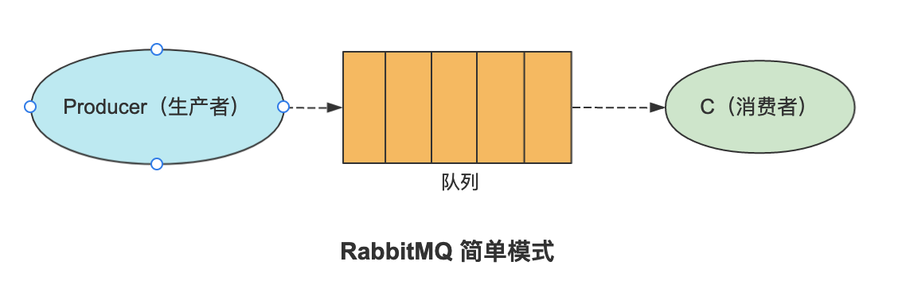
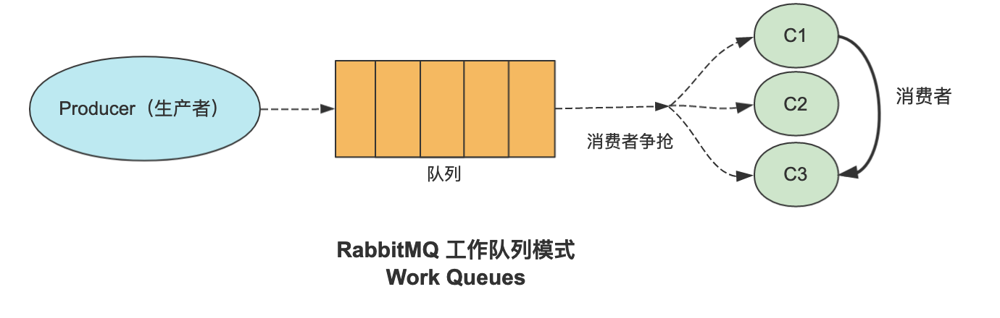
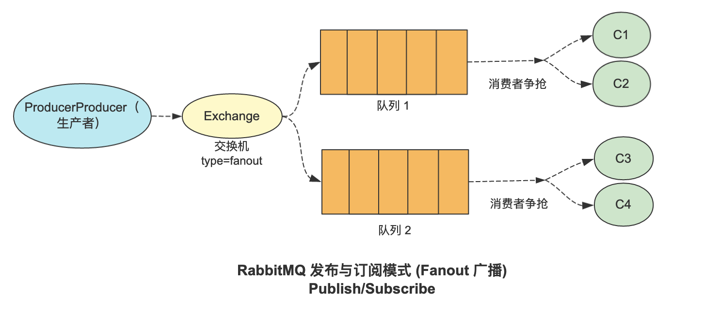
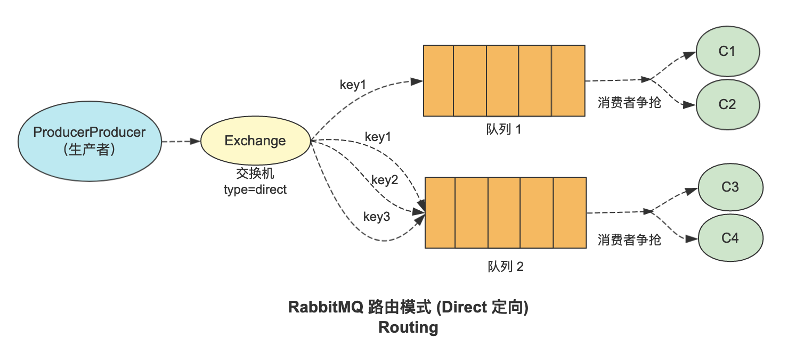
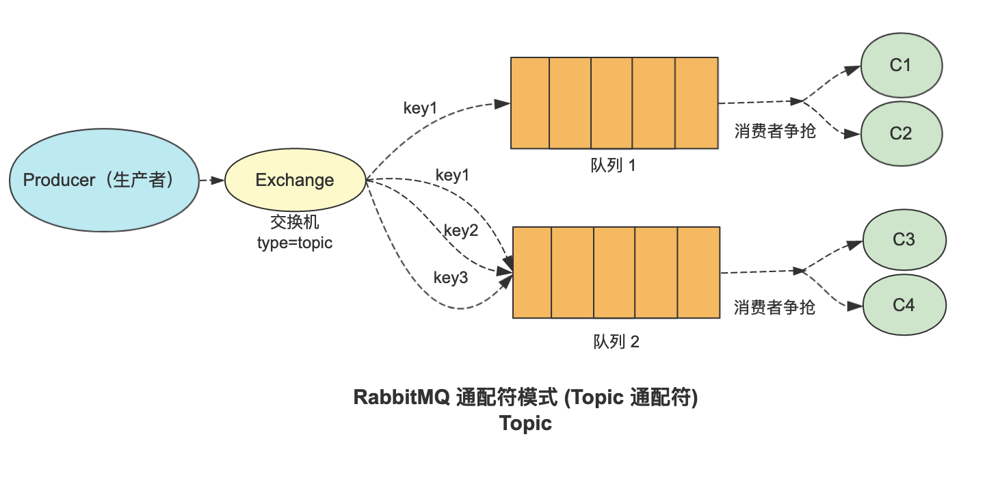

# RabbitMQ

官网：

[Messaging that just works — RabbitMQ](https://www.rabbitmq.com/)

## 工作模式

1. 简单模式：一个生产者、一个队列和一个消费者，生产者发送消息至队列，消费者监听队列并消费消息

   

2. worker 模式(工作队列模式)：一个生产者、一个队列和多个消费者，生产者发送消息至队列，多个消费者监听同一队列消费消息

   

3. 发布/订阅模式 (Fanout 广播)：

   publish/subscribe 模式包含一个生产者、一个交换机、多个队列及多个消费者，交换机（Exchange）和队列直接绑定，生产者通过交换机（Exchange）将消息存储在与交换机绑定的队列中，消费者监听队列并进行消费。

   

4. 路由模式：

   routing 模式可以根据 routing key 将消息发送给指定队列，交换机（Exchange）和队列通过routing key 进行绑定，生产者通过交换机（Exchange）和 routing key 将消息精准发送至队列，消费者监听队列并消费消息。

   

5. 主题模式：Topics 模式在路由模式的基础上支持通配符操作，交换机会根据通配符将消息存储在匹配成功的队列中，消费者监听队列并进行消费

   

6. RPC 模式：

   RPC 模式主要针对需要获取消费者处理结果的情况，通常是生产者将消息发送给了消费者，消费者接收到消息并进行消费后返回给生产者处理结果
