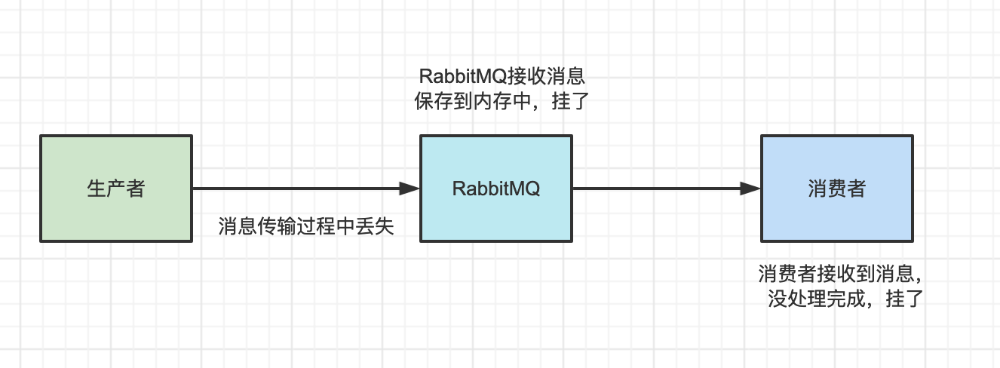

# RabbitMQ消息的可靠性传输

- 生产者丢失数据
- RabbitMQ 丢失了数据
- 消费端丢失了数据

## 生产者丢失数据

确认并且保证消息被送达，提供了两种方式：发布确认和事务。(两者不可同时使用)在channel为事务时，不可引入确认模式；同样channel为确认模式下，不可使用事务。

- 使用RabbitMQ 提供的事务功能。
  - **吞吐量会下来，因为太耗性能**
  - **事务机制是同步的**
- `confirm` 机制
  - `confirm` 机制是**异步**的
  - **普通 confirm 模式**：每发送一条消息后，调用 `waitForConfirms()` 方法，等待服务器端 confirm，如果服务端返回 false 或者在一段时间内都没返回，客户端可以进行消息重发。
  - **批量 confirm 模式**：每发送一批消息后，调用 `waitForConfirms()` 方法，等待服务端 confirm。
  - **异步 confirm 模式**：提供一个回调方法，服务端 confirm 了一条或者多条消息后客户端会回调这个方法。

## RabbitMQ 丢失了数据

- **开启 RabbitMQ 的持久化**，就是消息写入之后会持久化到磁盘，哪怕是 RabbitMQ 自己挂了，**恢复之后会自动读取之前存储的数据**，一般数据不会丢
- RabbitMQ 还没持久化，自己就挂了，**可能导致少量数据丢失**，但是这个概率较小。

如何设置持久化

1. 创建 queue 的时候将其设置为持久化。这样就可以保证 RabbitMQ 持久化 queue 的元数据，但是它是不会持久化 queue 里的数据的。
2. 发送消息的时候将消息的 `deliveryMode` 设置为 2。就是将消息设置为持久化的，此时 RabbitMQ 就会将消息持久化到磁盘上去。

> 所以，持久化可以跟生产者那边的 `confirm` 机制配合起来，只有消息被持久化到磁盘之后，才会通知生产者 `ack` 了，所以哪怕是在持久化到磁盘之前，RabbitMQ 挂了，数据丢了，生产者收不到 `ack` ，你也是可以自己重发的。
>
> spring boot 默认做了持久化。

## 消费端丢失了数据

为了保证消息从队列种可靠地到达消费者，RabbitMQ 提供了消息确认机制。消费者在声明队列时，可以指定 noAck 参数，当 noAck=false，RabbitMQ 会等待消费者显式发回 ack 信号后，才从内存（和磁盘，如果是持久化消息）中移去消息。否则，一旦消息被消费者消费，RabbitMQ 会在队列中立即删除它。
