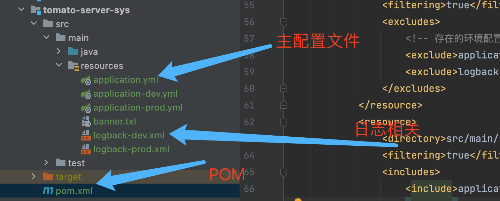
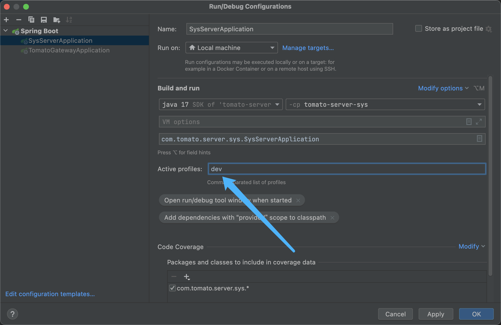

# SpringBoot 多配置文件

通常在公司级别的项目中，我们可能会写多个application- dev/prod.yml，用于区分各个环境。

项目结构：



## application.yml

- application.yml中类似Java中的父类。
- application- dev/prod.yml会继承这个文件，可以进行重写。

比如application.yml定义了一个my.name属性，然后我们激活的是application-dev.yml，但是我们并没有在文件中定义这个属性，我们在程序中还是能够读取的，类似于java的父子类继承重写。

```xml
spring:
  profiles:
    active: dev
```

此种方式已经弃用，原因是官方为了增加 Kubernetes Volume 的配置支持。推荐使用如下方式：

```xml
spring:
  config:
    activate:
      # 开启配置文件，默认配置在 POM 文件中
      on-profile: @profiles.active@
```

**注意：这种方式需要在启动的时候指定参数，要不然会报错：No active profile set, falling back to default profiles:default**



## POM

```xml
<profiles>
    <profile>
        <!-- 开发环境 -->
        <id>dev</id>
        <properties>
            <profiles.active>dev</profiles.active>
        </properties>
        <activation>
            <!-- 默认激活 -->
            <activeByDefault>true</activeByDefault>
        </activation>
    </profile>
    <profile>
        <!-- 生产环境 -->
        <id>prod</id>
        <properties>
            <profiles.active>prod</profiles.active>
        </properties>
    </profile>
</profiles>

<build>
    <resources>
        <resource>
            <directory>src/main/resources</directory>
            <filtering>true</filtering>
            <excludes>
                <!-- 存在的环境配置，如果不写那么就会把没写配置也打包进去 -->
                <exclude>application-*.yml</exclude>
                <exclude>logback-*.xml</exclude>
            </excludes>
        </resource>
        <resource>
            <directory>src/main/resources</directory>
            <filtering>true</filtering>
            <includes>
                <include>application.yml</include>
                <include>application-${profiles.active}.yml</include>
                <include>logback-${profiles.active}.xml</include>
            </includes>
        </resource>
    </resources>
</build>
```

## log 配置

application.yml 内进行配置。

```xml
# 日志配置
logging:
  config: classpath:logback-@profiles.active@.xml
```