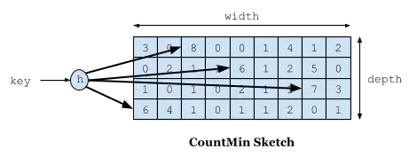
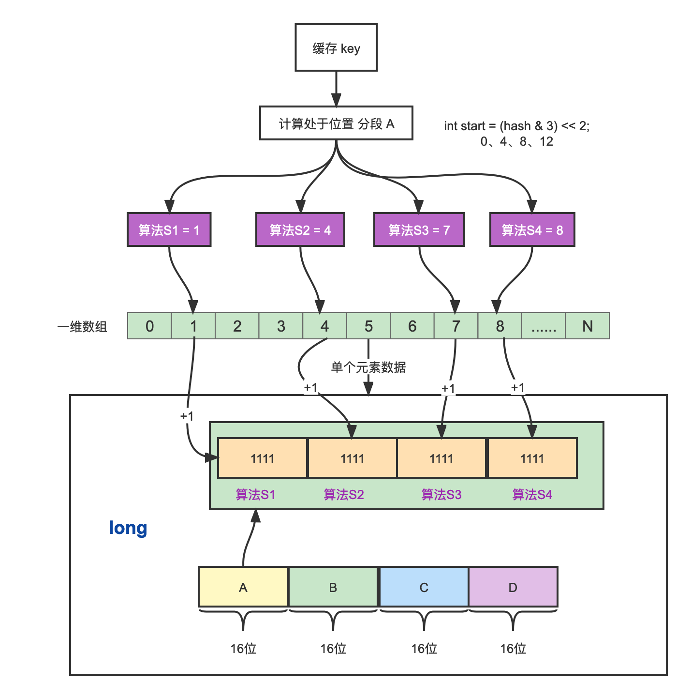

# SpringBoot集成Caffeine

Caffeine 因使用了 Window TinyLfu 回收策略，提供了一个近乎最佳的命中率。

```xml
<dependency>
    <groupId>com.github.ben-manes.caffeine</groupId>
    <artifactId>caffeine</artifactId>
</dependency>
```

因为使用代码比较简单，这里不再过多粘贴代码，有兴趣的可以去查看。https://gitee.com/lizhifu/tomato-cloud/tree/master/tomato-study/tomato-study-caffeine

## W-TinyLFU 算法

三种算法比较：

1. FIFO：先进先出，先进入缓存的会先被淘汰，会导致命中率很低。

2. LRU：最近最少使用，每次访问数据都会将其放在我们的队尾，如果需要淘汰数据，就只需要淘汰队首即可。

   问题：例如有个缓存 key 在 1 分钟访问了 10000次，再后 1 分钟没有访问这个数据，此时其他的数据访问，那么这个缓存 key 就有可能会被淘汰。并且如果偶然性的要对全量数据进行遍历，那么“历史访问记录”就会被刷走，造成污染。

3. LFU：最近最少频率使用，使用额外的空间记录每个缓存 key 的使用频率，然后选出频率最低进行淘汰。这样就避免了 LRU 不能处理时间段的问题。

   问题：需要使用额外的存储空间；对突发性的稀疏流量无力，因为前期经常访问的记录已经占用了缓存，偶然的流量不太可能会被保留下来，例如秒杀，这些访问量较大，但是秒杀结束后就没有了使用价值，此时缓存会一直存在。

总结：W-TinyLFU就是结合LFU和LRU，LFU用来应对大多数场景，LRU用来处理突发流量。


## Count-Min Sketch 算法

Count-Min Sketch 记录我们的访问频率，原理跟 Bloom Filter 一样，只不过 Bloom Filter 只有 0 和 1 的值，那么你可以把 Count–Min Sketch 看作是“数值”版的 Bloom Filter。

基本的思路：

1. 创建一个长度为 x 的数组，用来计数，初始化每个元素的计数值为 0；
2. 对于一个新来的元素，哈希到 0 到 x 之间的一个数，比如哈希值为 i，作为数组的位置索引；
3. 这是，数组对应的位置索引 i 的计数值加 1；
4. 那么，这时要查询某个元素出现的频率，只要简单的返回这个元素哈希望后对应的数组的位置索引的计数值即可。



类似于一个二维数组int[width][depth]，depth表示4种不同的hash算法，如果只用一个hash算法，那么两个key产生hash冲突的概率是0.1，那么四个hash冲突的概率则为0.1的四次方。所以从四个hash算法中找到对应的数值，取最小的数值则为这个key的实际频率。


## Caffeine 实现Count-Min Sketch 算法

Caffeine 对这个算法的实现在`FrequencySketch`。

1. Caffeine 中采用了一个long类型的一维数组进行记录频率，数组的大小为最接近的2的幂的数。
2. Caffeine 中规定频率最大为15，15的二进制位1111，总共是4位。
3. Caffeine 只用了四种hash算法，每个Long型被分为四段，每段里面保存的是四个算法的频率。这样做的好处是可以进一步减少Hash冲突。等于是在原有基础上 X4。


缓存访问频率计算思路：

1. 计算缓存 key 所在 4 个段的哪个段内。
2. 对缓存  key 4 次计算long数组的位置。
3. 疑频率最大为15，超过进行全局除以2衰减。



## 保新（衰减机制）

为了让缓存保持“新鲜”，剔除掉过往频率很高但之后不经常的缓存，Caffeine 有一个新鲜度机制。就是当整体的统计计数达到某一个值时，那么所有记录的频率统计除以 2。比如size等于100，如果他全局提升了size*10也就是1000次就会全局除以2衰减，衰减之后也可以继续增加。

```java
// size变量就是所有记录的频率统计之，即每个记录加1，这个size都会加1
// sampleSize一个阈值，从FrequencySketch初始化可以看到它的值为maximumSize的10倍
if (added && (++size == sampleSize)) {
 reset();
}

void reset() {
 int count = 0;
 for (int i = 0; i < table.length; i++) {
 count += Long.bitCount(table[i] & ONE_MASK);
 table[i] = (table[i] >>> 1) & RESET_MASK;
 }
 size = (size >>> 1) - (count >>> 2);
}
```

## 源码注释

FrequencySketch的一些属性:

```java
// 种子数
static final long[] SEED = { // A mixture of seeds from FNV-1a, CityHash, and Murmur3
    0xc3a5c85c97cb3127L, 0xb492b66fbe98f273L, 0x9ae16a3b2f90404fL, 0xcbf29ce484222325L};
static final long RESET_MASK = 0x7777777777777777L;
static final long ONE_MASK = 0x1111111111111111L;

int sampleSize;
// 为了快速根据hash值得到table的index值的掩码
// table的长度size一般为2的n次方，而tableMask为size-1，这样就可以通过&操作来模拟取余操作
int tableMask;
// 存储数据的一维long数组
long[] table;
int size;
```

```java
public void increment(@NonNull E e) {
  if (isNotInitialized()) {
    return;
  }
	// 根据key的hashCode通过一个哈希函数得到一个hash值
  int hash = spread(e.hashCode());
  // 把一个long的64bit划分成16个等分，每一等分4个bit
  // 用来定位到是哪一个等分的，用hash值低两位作为随机数，再左移2位，得到一个小于16的值
  // start 值：0、4、8、12
  // 3 二进制 0011，& 必定能获得小于4的数字
  int start = (hash & 3) << 2;

  // Loop unrolling improves throughput by 5m ops/s
  // indexOf方法的意思就是，根据hash值和不同种子得到table的下标index
  // 这里通过四个不同的种子，得到四个不同的下标index
  int index0 = indexOf(hash, 0);
  int index1 = indexOf(hash, 1);
  int index2 = indexOf(hash, 2);
  int index3 = indexOf(hash, 3);
	// 根据index和start(+1, +2, +3)的值，把table[index]对应的等分追加1
  boolean added = incrementAt(index0, start);
  added |= incrementAt(index1, start + 1);
  added |= incrementAt(index2, start + 2);
  added |= incrementAt(index3, start + 3);

  if (added && (++size == sampleSize)) {
    reset();
  }
}
```

```java
// 作用是根据key的hashCode通过一个哈希函数得到一个hash值
// 解决 hashCode 不够均匀分散，再打散一下
// x 值为 key 的 hashcode
int spread(int x) {
  x = ((x >>> 16) ^ x) * 0x45d9f3b;
  x = ((x >>> 16) ^ x) * 0x45d9f3b;
  return (x >>> 16) ^ x;
}
```