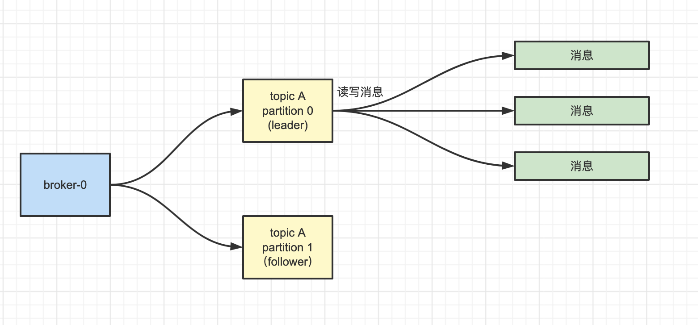

# kafka分区

在 Kafka 中，Topic 只是一个逻辑上的概念，**而组成 Topic 的分区 Partition 才是真正存消息的地方**。

- 一个 Topic 分成了多个 Partition
- 不同的 Partition 尽可能的部署在不同的物理节点上
- 消费者可以消费多个 Partition 中的数据
- 通过消费者组，来消费整个的 Topic，一个消费者消费 Topic 中的一个分区 Partition 

## 单分区

## spring boot

