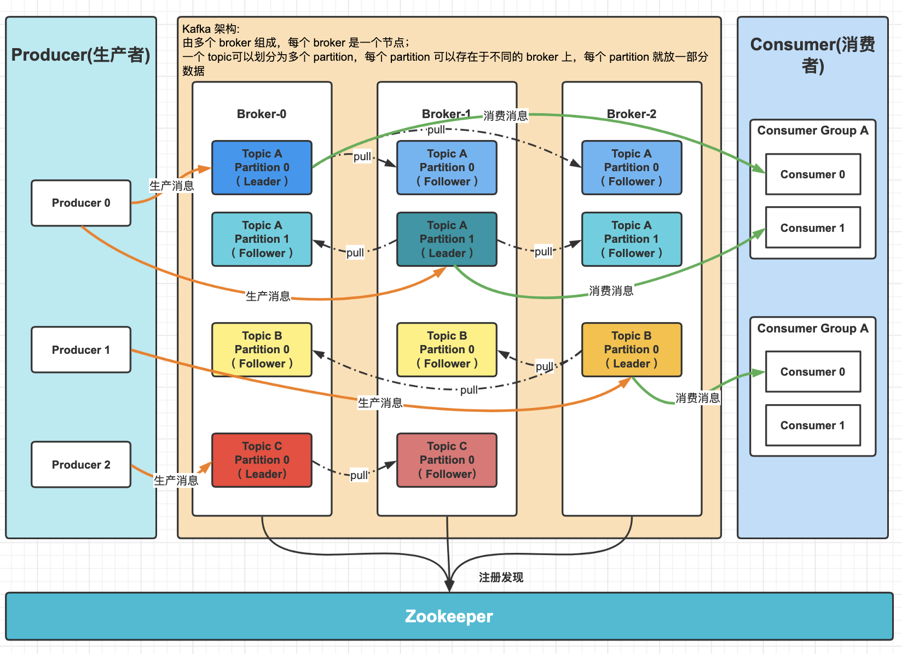
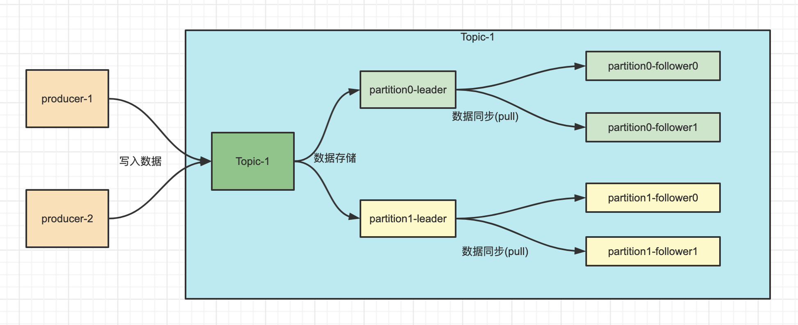
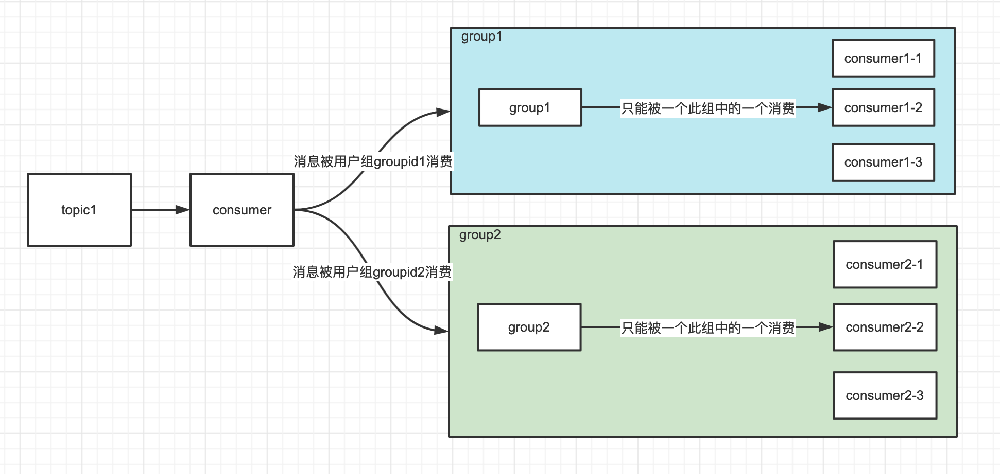

# kafka

## 架构图

- Kafka 由多个 broker 组成，每个 broker 是一个节点。
- 创建一个 topic可以划分为多个 partition，每个 partition 可以存在于不同的 broker 上，每个 partition 就放一部分数据。
- 写数据
  - 生产者就写 leader，然后 leader 将数据落地写本地磁盘
  - 其他 follower 自己主动从 leader 来 poll 数据
  - 所有 follower 同步好数据了，就会发送 ack 给 leader
  - leader 收到所有 follower 的 ack 之后，就会返回写成功的消息给生产者
  - 如果某个 broker 宕机了，这个 broker 上面的 partition 在其他机器上都有副本的。如果这个宕机的 broker 上面有某个 partition 的 leader，那么此时会从 follower 中**重新选举**一个新的 leader 出来，大家继续读写那个新的 leader 即可。这就有所谓的高可用性了。
- 读数据
  - **消费**的时候，只会从 leader 去读
  - 但是只有当一个消息已经被所有 follower 都同步成功返回 ack 的时候，这个消息才会被消费者读到

## 集群

在 Kafka 中，为实现「**数据备份**」的功能，保证集群中的某个节点发生故障时，该节点上的 Partition 数据不丢失，且 Kafka 仍然能够继续工作，**为此 Kafka 提供了副本机制，一个 Topic 的每个 Partition 都有若干个副本，一个 Leader 副本和若干个 Follower 副本**。

## 消息生产流程

## 消息消费流程

