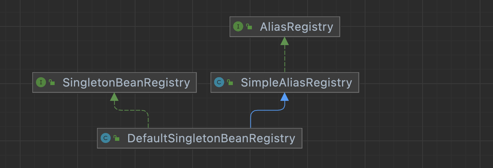

# Spring 循环依赖

什么是循环依赖：

简单说，就是A对象依赖了B对象，B对象依赖了A对象。 

运行环境：jdk1.8 、spring boot 2.6.4


## 循环依赖的核心类解读

spring bean 装载的核心类 DefaultSingletonBeanRegistry 。



- 三级缓存存储对象

  - 一级缓存：singletonObjects，单例池，存放的是bean对象

  - 二级缓存：singletonFactories，对象工厂，用于存放对象工厂，或者代理后的对象工厂

  - 三级缓存：earlySingletonObjects，早期创建对象，这个对象可能是个半成品，还没有走完bean的生命周期

  源码：

  ```java
  /** Cache of singleton objects: bean name to bean instance. */
  /** 成品对象:用于保存实例化、注入、初始化完成的bean实例 */
  // 一级缓存:单例池，存放的是bean对象
  private final Map<String, Object> singletonObjects = new ConcurrentHashMap<>(256);
  
  /** Cache of singleton factories: bean name to ObjectFactory. */
  /** 工厂对象:用于保存bean创建工厂，以便于后面扩展有机会创建代理对象。 */
  // 二级缓存:存放对象工厂，或者代理后的对象工厂
  private final Map<String, ObjectFactory<?>> singletonFactories = new HashMap<>(16);
  
  /** Cache of early singleton objects: bean name to bean instance. */
  /** 半成品对象:用于保存实例化完成的bean实例 */
  // 三级缓存:早期创建对象，这个对象可能是个半成品，还没有走完bean的生命周期
  private final Map<String, Object> earlySingletonObjects = new ConcurrentHashMap<>(16);
  
  /** Set of registered singletons, containing the bean names in registration order. */
  // 已经注册的单例池里的beanName
  private final Set<String> registeredSingletons = new LinkedHashSet<>(256);
  
  /** Names of beans that are currently in creation. */
  /** 当前正在创建的对象:防止了bean对象在循环引用的过程中重复创建的问题 */
  private final Set<String> singletonsCurrentlyInCreation = Collections.newSetFromMap(new ConcurrentHashMap<>(16));
  ```

- 三级缓存使用方法

  getSingleton：

  ```java
  @Override
  @Nullable
  public Object getSingleton(String beanName) {
     return getSingleton(beanName, true);
  }
  	/**
  	 * Return the (raw) singleton object registered under the given name.
  	 * 返回在给定名称下注册的（原始）单例对象。
  	 * <p>Checks already instantiated singletons and also allows for an early
  	 * reference to a currently created singleton (resolving a circular reference).
  	 * @param beanName the name of the bean to look for
  	 * @param allowEarlyReference whether early references should be created or not
  	 * @return the registered singleton object, or {@code null} if none found
  	 */
  	@Nullable
  	protected Object getSingleton(String beanName, boolean allowEarlyReference) {
  		// Quick check for existing instance without full singleton lock
      // 快速检查没有完整单例锁的现有实例
      // 先从一级缓存中获取bean
  		Object singletonObject = this.singletonObjects.get(beanName);
      // 判断是否已经创建完成 && 是否创建中
      // 一级缓存中没有，并且正在创建中
  		if (singletonObject == null && isSingletonCurrentlyInCreation(beanName)) {
        // 用于保存实例化完成的bean实例
        // 从三级缓存中取（循环依赖情况下，会很有用）
  			singletonObject = this.earlySingletonObjects.get(beanName);
        // 三级缓存中没有 && 允许循环依赖（走到这里，默认值为true）
  			if (singletonObject == null && allowEarlyReference) {
          // 对一级缓存加锁 && double check
  				synchronized (this.singletonObjects) {
  					// Consistent creation of early reference within full singleton lock
  					singletonObject = this.singletonObjects.get(beanName);
  					if (singletonObject == null) {
              // 再次从三级缓存中取
  						singletonObject = this.earlySingletonObjects.get(beanName);
  						if (singletonObject == null) {
                // 从二级缓存中取 >>> 取到的是一个对象工厂 >>> 有代理时取到的是一个代理对象
  							ObjectFactory<?> singletonFactory = this.singletonFactories.get(beanName);
  							if (singletonFactory != null) {
                  // 对象工厂中获取对象
  								singletonObject = singletonFactory.getObject();
  								this.earlySingletonObjects.put(beanName, singletonObject);
  								this.singletonFactories.remove(beanName);
  							}
  						}
  					}
  				}
  			}
  		}
  		return singletonObject;
  	}
	```
  
	注册bean：registerSingleton，添加到第1级缓存
  
  ```java
  public void registerSingleton(String beanName, Object singletonObject) throws IllegalStateException {
     Assert.notNull(beanName, "Bean name must not be null");
     Assert.notNull(singletonObject, "Singleton object must not be null");
     synchronized (this.singletonObjects) {
        Object oldObject = this.singletonObjects.get(beanName);
        if (oldObject != null) {
           throw new IllegalStateException("Could not register object [" + singletonObject +
                 "] under bean name '" + beanName + "': there is already object [" + oldObject + "] bound");
        }
        addSingleton(beanName, singletonObject);
     }
  }
  	/**
  	 * Add the given singleton object to the singleton cache of this factory.
  	 * <p>To be called for eager registration of singletons.
  	 * @param beanName the name of the bean
  	 * @param singletonObject the singleton object
  	 */
  	protected void addSingleton(String beanName, Object singletonObject) {
  		synchronized (this.singletonObjects) {
        // 放入第1级缓存
  			this.singletonObjects.put(beanName, singletonObject);
        // 从第3级缓存删除
  			this.singletonFactories.remove(beanName);
        // 从第2级缓存删除
  			this.earlySingletonObjects.remove(beanName);
	      // 放入已注册的单例池里
				this.registeredSingletons.add(beanName);
			}
		}
	```
	
	addSingletonFactory，添加到第3级缓存
	
	```java
	/**
	 * Add the given singleton factory for building the specified singleton
	 * if necessary.
	 * <p>To be called for eager registration of singletons, e.g. to be able to
	 * resolve circular references.
	 * @param beanName the name of the bean
	 * @param singletonFactory the factory for the singleton object
	 */
	protected void addSingletonFactory(String beanName, ObjectFactory<?> singletonFactory) {
	   Assert.notNull(singletonFactory, "Singleton factory must not be null");
	   synchronized (this.singletonObjects) {
	     // 若第1级缓存没有bean实例
	      if (!this.singletonObjects.containsKey(beanName)) {
	         // 放入第3级缓存
	         this.singletonFactories.put(beanName, singletonFactory);
	         // 从第2级缓存删除，确保第2级缓存没有该bean
	         this.earlySingletonObjects.remove(beanName);
	         // 放入已注册的单例池里
	         this.registeredSingletons.add(beanName);
	      }
	   }
	}
	```
	


## 实例1

使用 @Resource 注解

```java
@Service
public class BRelyService {
    @Resource
    private ARelyService relyService;
    public void bRely() {
        System.out.println("bRely");
    }
}
@Service
public class ARelyService {
    @Resource
    private BRelyService bRelyService;
    public void aRely() {
        System.out.println("aRely");
    }
}
```

启动报错日志：

```java
The dependencies of some of the beans in the application context form a cycle:

┌─────┐
|  ARelyService
↑     ↓
|  BRelyService
└─────┘
```

## 实例2

使用 @Autowired 注解 

```java
@Service
public class BRelyService {
    @Autowired
    private ARelyService relyService;
    public void bRely() {
        System.out.println("bRely");
    }
}
@Service
public class ARelyService {
    @Autowired
    private BRelyService bRelyService;
    public void aRely() {
        System.out.println("aRely");
    }
}
```

启动报错日志：

```java
The dependencies of some of the beans in the application context form a cycle:

┌─────┐
|  ARelyService (field private com.tomato.study.spring.service.rely.BRelyService com.tomato.study.spring.service.rely.ARelyService.bRelyService)
↑     ↓
|  BRelyService (field private com.tomato.study.spring.service.rely.ARelyService com.tomato.study.spring.service.rely.BRelyService.relyService)
└─────┘
```

## 实例3

使用 @Lazy 注解 

```java
@Service
public class BRelyService {
    @Autowired
    @Lazy
    private ARelyService relyService;
    public void bRely() {
        System.out.println("bRely");
    }
}
@Service
public class ARelyService {
    @Autowired
    private BRelyService bRelyService;
    public void aRely() {
        System.out.println("aRely");
    }
}
```

正常启动。

## 实例4

spring.main.allow-circular-references = true

```java
@SpringBootApplication
public class TomatoStudySpringApplication {
    public static void main(String[] args){
        SpringApplication sa = new SpringApplication(TomatoStudySpringApplication.class);
        //spring:
        //  main:
        //    allow-circular-references: true
        sa.setAllowCircularReferences(Boolean.TRUE);
        sa.run(args);
        System.out.println("spring study 服务启动成功");
    }
}
@Service
public class ARelyService {
    @Autowired
    private BRelyService bRelyService;
    public void aRely() {
        System.out.println("aRely");
    }
}
@Service
public class BRelyService {
    @Autowired
    private ARelyService relyService;
    public void bRely() {
        System.out.println("bRely");
    }
}
```

正常启动。

## 实例5

使用 @Scope(value = ConfigurableBeanFactory.SCOPE_PROTOTYPE)，此时属于多例了。

```java
@Service
@Scope(ConfigurableBeanFactory.SCOPE_PROTOTYPE)
public class BRelyService {
    @Autowired
    private ARelyService relyService;
    public void bRely() {
        System.out.println("bRely");
    }
}
@Service
@Scope(ConfigurableBeanFactory.SCOPE_PROTOTYPE)
public class ARelyService {
    @Autowired
    private BRelyService bRelyService;
    public void aRely() {
        System.out.println("aRely");
    }
}
```

正常启动。

## 实例6

使用 @DependsOn 

```java
@Service("bRelyService")
@DependsOn(value = "aRelyService")
public class BRelyService {
    @Autowired
    private ARelyService arelyService;
    public void bRely() {
        System.out.println("bRely");
    }
}
@Service("aRelyService")
@DependsOn(value = "bRelyService")
public class ARelyService {
    @Autowired
    private BRelyService bRelyService;
    public void aRely() {
        System.out.println("aRely");
    }
}
```

启动报错：

```java
Circular depends-on relationship between 'bRelyService' and 'aRelyService'
```