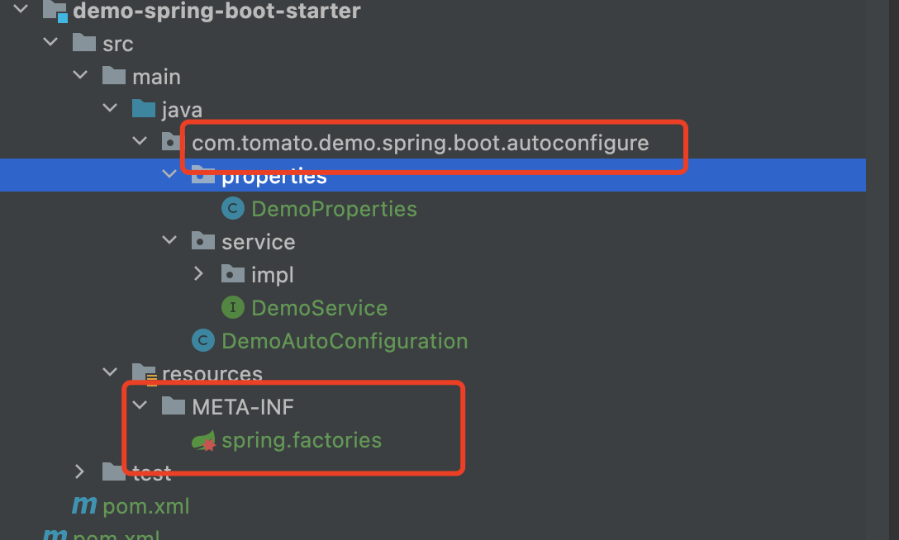

# Spring boot 自定义starter

starter 是 SpringBoot 中一种非常重要的机制，它可以繁杂的配置统一集成到 starter 中，我们只需要通过 maven 将 starter 依赖引入到项目中，SpringBoot会为我们完成自动装配，SpringBoot 就能自动扫描并加载相应的默认配置。

## 命名规则

- SpringBoot官方提供的 starter 以 spring-boot-starter-xxx 的形式命名，例如：

  - spring-boot-starter-aop

  - spring-boot-starter-data-jdbc

- 第三方自定义的 starter 使用 xxx-spring-boot-starter 的形式命名，例如 ：

  - mybatis-spring-boot-starter

  - druid-spring-boot-starter

- package 规则：

  ```java
  com.tomato.demo.spring.boot.autoconfigure
  ```

## 开始构建

1. 添加 POM 依赖

   ```xml
   <!--   核心启动器，包含自动配置，日志及yaml      -->
   <dependency>
     <groupId>org.springframework.boot</groupId>
     <artifactId>spring-boot-starter</artifactId>
   </dependency>
   ```

2. 核心自动装配

   ```java
   // 表示该类是一个配置类
   @Configuration
   // 该注解的作用是为 DemoProperties 开启属性配置功能，并将这个类以组件的形式注入到容器中
   @EnableConfigurationProperties(DemoProperties.class)
   // 当指定的配置项等于你想要的时候，配置类生效
   // @ConditionalOnProperty(prefix = "xxx", name= "x", matchIfMissing = true)
   public class DemoAutoConfiguration {
   
       // 将方法的返回值以 Bean 对象的形式添加到容器中
       @Bean
       // 当容器中没有 DemoServiceImpl 类时，该方法才生效
       @ConditionalOnMissingBean(DemoService.class)
       public DemoService demoService() {
           return new DemoServiceImpl();
       }
   }
   ```

3. spring.factories

   Spring Factories 机制是 Spring Boot 中的一种服务发现机制，这种扩展机制与 Java SPI 机制十分相似。Spring Boot 会自动扫描所有 Jar 包类路径下 META-INF/spring.factories 文件，并读取其中的内容，进行实例化，这种机制也是 Spring Boot Starter 的基础。因此我们自定义 starter 时，需要在项目类路径下创建一个 spring.factories 文件。

   ```properties
   org.springframework.boot.autoconfigure.EnableAutoConfiguration=\
     com.tomato.demo.spring.boot.autoconfigure.DemoAutoConfiguration
   ```

## 整体目录结构


