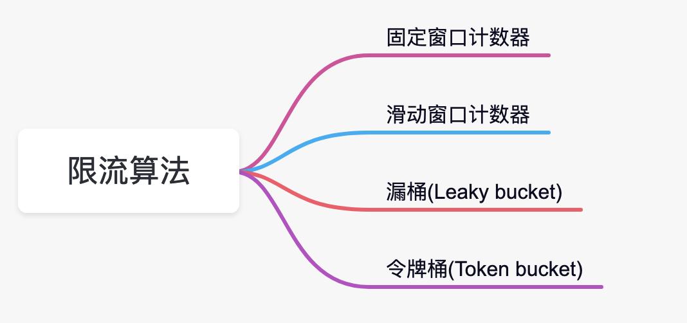
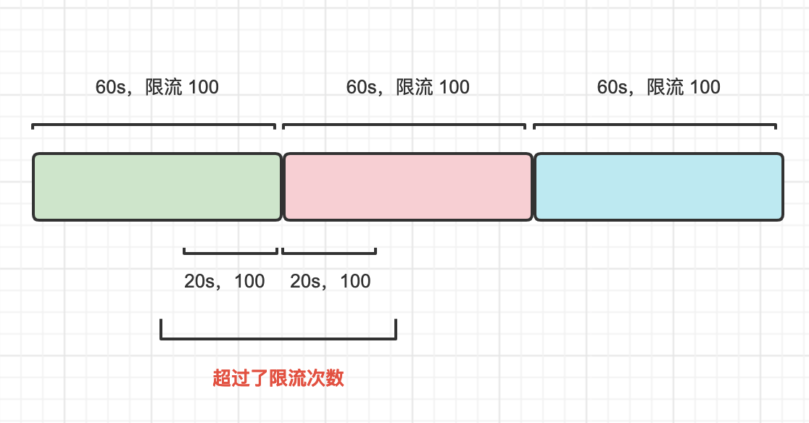
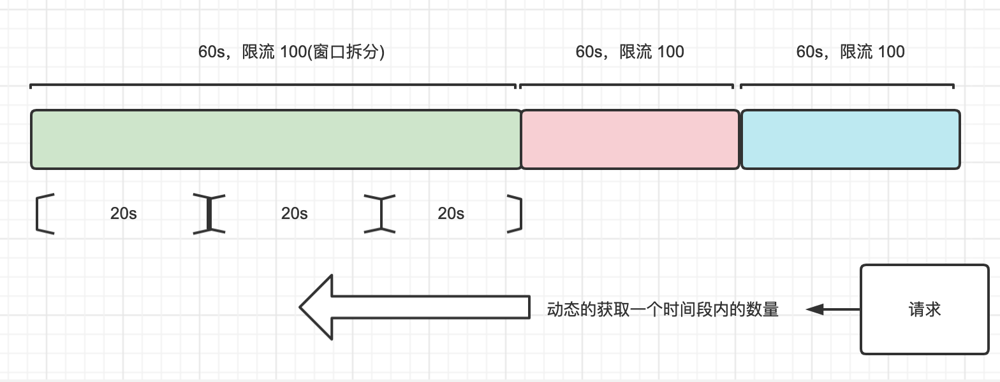

# 限流算法

## 固定窗口计数器

一个固定的时间窗口内的请求数量进行计数，如果超过请求数量的阈值，将被直接丢弃。

## 滑动窗口计数器

时间窗口在随着时间推移不停地移动。把一个固定时间窗口再继续拆分成N个小窗口，然后对每个小窗口分别进行计数，所有小窗口请求之和不能超过我们设定的限流阈值。

## 漏桶(Leaky bucket)

1. 流量流入的速度是不定的
2. 固定的出口流量大小匀速流出

## 令牌桶(Token bucket)

令牌桶算法是指系统以一定地速度往令牌桶里丢令牌，当一个请求过来的时候，会去令牌桶里申请一个令牌，如果能够获取到令牌，那么请求就可以正常进行，反之被丢弃。

现在的令牌桶算法，像Guava和Sentinel的实现都有冷启动/预热的方式，为了避免在流量激增的同时把系统打挂，令牌桶算法会在最开始一段时间内**冷启动**，随着流量的增加，系统会根据流量大小动态地调整生成令牌的速度，最终直到请求达到系统的阈值。