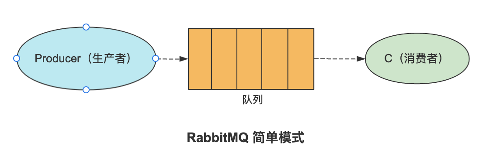
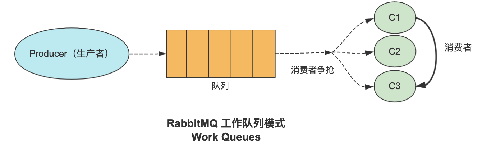
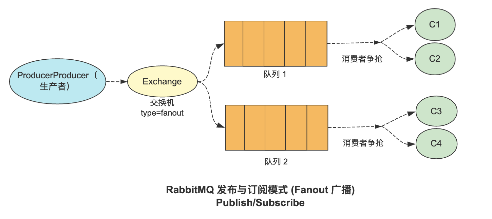
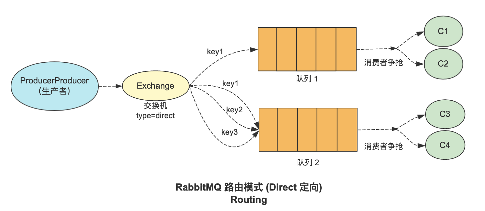
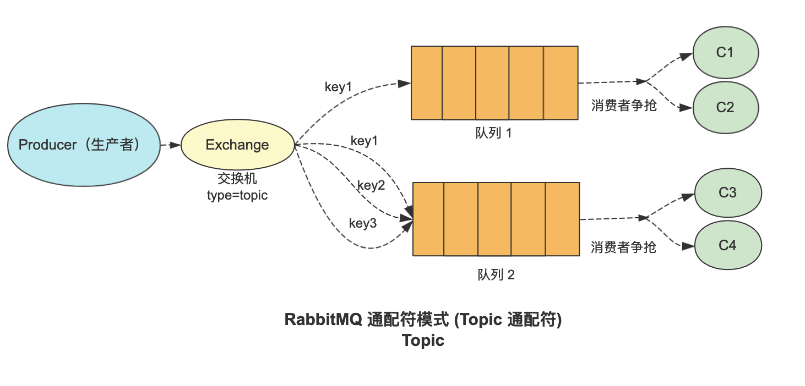

# RabbitMQ

官网：

[Messaging that just works — RabbitMQ](https://www.rabbitmq.com/)

[The Homebrew RabbitMQ Formula — RabbitMQ](https://www.rabbitmq.com/install-homebrew.html)

安装：

```shell
brew install rabbitmq

==> Pouring rabbitmq--3.9.13.all.bottle.tar.gz
==> Caveats
Management Plugin enabled by default at http://localhost:15672

To restart rabbitmq after an upgrade:
  brew services restart rabbitmq
Or, if you don't want/need a background service you can just run:
  CONF_ENV_FILE="/usr/local/etc/rabbitmq/rabbitmq-env.conf" /usr/local/opt/rabbitmq/sbin/rabbitmq-server
==> Summary
🍺  /usr/local/Cellar/rabbitmq/3.9.13: 1,390 files, 30.1MB
==> Running `brew cleanup rabbitmq`...
Disable this behaviour by setting HOMEBREW_NO_INSTALL_CLEANUP.
Hide these hints with HOMEBREW_NO_ENV_HINTS (see `man brew`).
Removing: /usr/local/Cellar/rabbitmq/3.8.9_1... (117 files, 26.5MB)
==> Caveats
==> rabbitmq
Management Plugin enabled by default at http://localhost:15672

To restart rabbitmq after an upgrade:
  brew services restart rabbitmq
Or, if you don't want/need a background service you can just run:
  CONF_ENV_FILE="/usr/local/etc/rabbitmq/rabbitmq-env.conf" /usr/local/opt/rabbitmq/sbin/rabbitmq-server
➜  ~
```

启动：http://localhost:15672/ guest/guesg

```shell
/usr/local/Cellar/rabbitmq/3.11.5
./sbin/rabbitmq-server

-- 后台运行
brew services start rabbitmq
```

## RabbitMQWeb管理界面及授权操作

```shell
rabbitmq-plugins enable rabbitmq_management
```

## 延迟队列插件

地址：https://github.com/rabbitmq/rabbitmq-delayed-message-exchange

下载rabbitmq_delayed_message_exchange 插件，然后解压放置到 RabbitMQ 的插件目录。

```
/usr/local/Cellar/rabbitmq/3.9.13/plugins
```

进入 RabbitMQ 的安装目录下的 plgins 目录，执行下面命令让该插件生效，然后重启 RabbitMQ

```
./rabbitmq-plugins enable rabbitmq_delayed_message_exchange
```

## 工作模式

1. 简单模式：一个生产者、一个队列和一个消费者，生产者发送消息至队列，消费者监听队列并消费消息

   

2. worker 模式(工作队列模式)：一个生产者、一个队列和多个消费者，生产者发送消息至队列，多个消费者监听同一队列消费消息

   

3. 发布/订阅模式 (Fanout 广播)：

   publish/subscribe 模式包含一个生产者、一个交换机、多个队列及多个消费者，交换机（Exchange）和队列直接绑定，生产者通过交换机（Exchange）将消息存储在与交换机绑定的队列中，消费者监听队列并进行消费。

   

4. 路由模式：

   routing 模式可以根据 routing key 将消息发送给指定队列，交换机（Exchange）和队列通过routing key 进行绑定，生产者通过交换机（Exchange）和 routing key 将消息精准发送至队列，消费者监听队列并消费消息。

   

5. 主题模式：Topics 模式在路由模式的基础上支持通配符操作，交换机会根据通配符将消息存储在匹配成功的队列中，消费者监听队列并进行消费

   

6. Header模式：

   header模式与routing不同的地方在于，header模式取消routingkey，使用header中的 key/value（键值对）匹配队列。

   

7. RPC 模式：

   RPC 模式主要针对需要获取消费者处理结果的情况，通常是生产者将消息发送给了消费者，消费者接收到消息并进行消费后返回给生产者处理结果