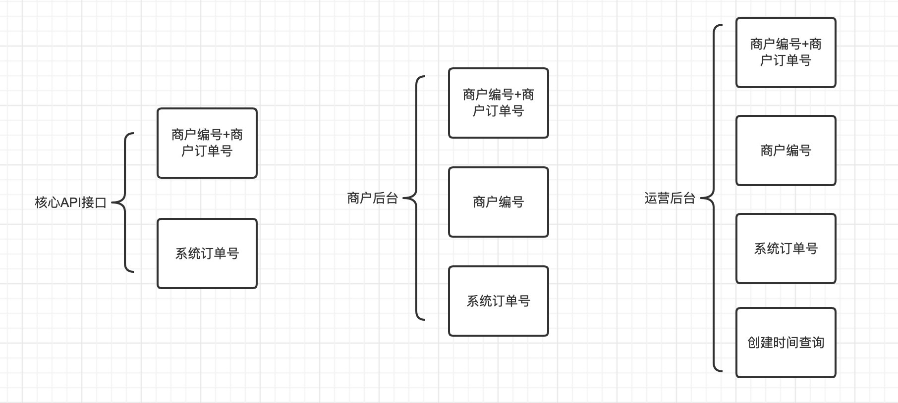
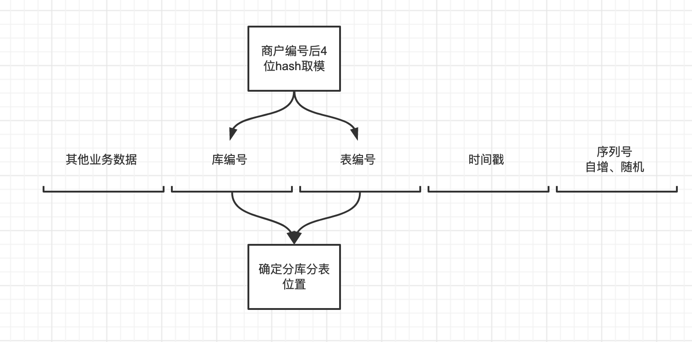

# 支付业务订单系统分库分表

支付系统中订单业务最主要的查询维度有四个：订单、用户、商家、运营。

从查询数据库字段的角度来讲，B2B、B2C等模式：

- **商户编号+商户订单号查询**，商户编号+商户订单号属于唯一性约束。
- **商户编号查询**，例如商户后台查询，运营后台查询。
- **系统订单号查询**，订单系统自身生成，全局唯一性约束。
- **用户编号查询**，例如电商业务，查询自己的订单
- **系统订单号+用户编号查询**，例如用户精准查询个人订单
- **无条件查询**，例如运营后台查询

# B2B业务

设计到分库分表字段的核心查询业务：

- **商户编号+商户订单号查询**，商户编号+商户订单号属于唯一性约束。
- **商户编号查询**，例如商户后台查询，运营后台查询。
- **系统订单号查询**，订单系统自身生成，全局唯一性约束。

一种分库分表思路：

**系统订单号**生成规则：通过将分库分表的数据写入到生成规则内，这样可以进行定位位置。

**商户编号**规则：取商户编号后4位做分片键，进行hash取模。

# B2C业务

建议把订单数据冗余一份，分买家库和卖家库，数据库通过消息中间件或者其他同步工具进行异步更新，这种场景最好将买家库的分片键(截取买家ID)和卖家库(截取卖家ID)的分片键都包含在订单ID中，这样卖家相关的业务查询订单明细时，可以直接走卖家库。

# 综合分析

**如果是 2C 和 2B 业务综合存在，建议进行业务拆分，没有必要把数据全部放在同一个业务逻辑内。**

订单数据有个比较特殊的点，随着时间的推进，大量的数据会变成冷数据，使用率会降低。还有一种根据创建时间来进行分表是一个不错的选择。所以分库分表其实没有统一的方案，要根据业务进行详细的设计。

例如根据创建时间来进行分表：

1. **时间差**，是不是要冗余查询，因为**支付订单的时效性**来讲，是不是可以默认查询2天的数据。
2. 支付订单是存在有效期的，比如订单过期，所以是不是可以设置规则，接口只能查询当日的数据。
3. 商户后台可以通过一些数据同步手段，例如 canal 同步到 es 等等手段。

**总结：实际场景实际分析，没有统一的方案。**