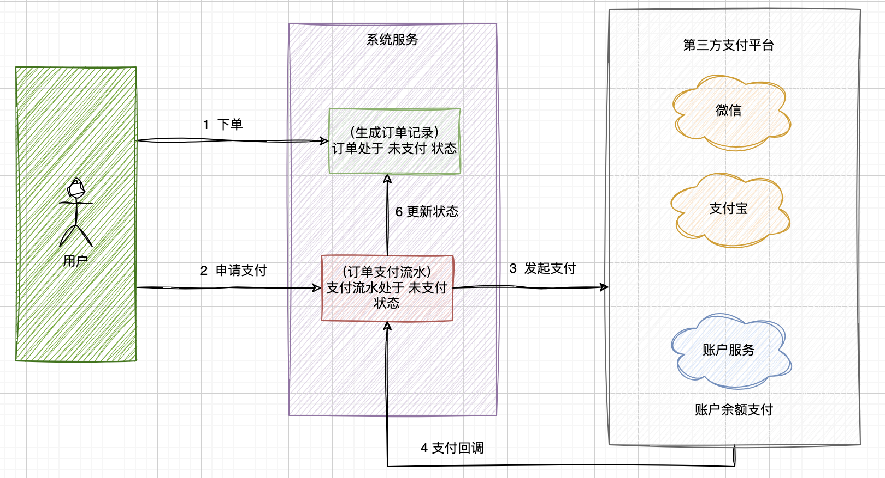

# 高并发下防止重复下单

## 幂等性

一个接口如果幂等，不管被调多少次，只要参数不变，结果也不变。

核心流程：一锁、二判、三更新。

## 主要解决方案

- 提交订单按钮置灰
  - 可以防止重复点击提交按钮造成的重复提交问题
  - 前进后退操作，或者F5刷新页面等问题并不能得到解决
- 请求唯一ID+数据库唯一索引约束
  - 客户端在请求下单接口的时候，需要生成一个唯一的请求号
  - 服务端拿这个请求号，判断是否重复请求
- reids分布式锁+请求唯一ID+数据库唯一索引约束
  - 当用户进入订单提交界面的时候，调用后端获取请求唯一 ID，同时后端将请求唯一ID存储到`redis`中再返回给前端
  - 当用户点击提交按钮时，后端检查这个请求唯一 ID 是否存在，如果不存在，提示错误信息；如果存在，继续后续检查流程
  - 使用`redis`的分布式锁服务，对请求 ID 在限定的时间内进行加锁，如果加锁成功，继续后续流程；如果加锁失败，提示说明：服务正在处理，请勿重复提交
  - 最后一步，如果加锁成功后，需要将锁手动释放掉，以免再次请求时，提示同样的信息；同时如果任务执行成功，需要将`redis`中的请求唯一 ID 清理掉
- reids分布式锁+token+数据库唯一索引约束
  - 用户点击提交按钮，服务端接受到请求后，通过规则计算出本次请求唯一ID值；应用名+接口名+方法名+请求参数签名（请求header、body参数，取SHA1值）
  - 使用`redis`的分布式锁服务，对请求 ID 在限定的时间内尝试进行加锁，如果加锁成功，继续后续流程；如果加锁失败，说明服务正在处理，请勿重复提交。
  - 最后一步，如果加锁成功后，需要将锁手动释放掉，以免再次请求时，提示同样的信息。