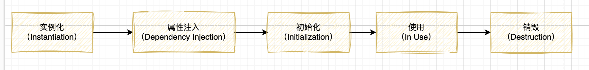

# SpringBean生命周期

文章源码：[spring-learn/spring-bean at main · lizhifuabc/spring-learn (github.com)](https://github.com/lizhifuabc/spring-learn/tree/main/spring-bean)

SpringBean的生命周期指的是在Spring框架中，一个Bean从被创建到被销毁的整个过程。Spring框架提供了一些生命周期回调方法，可以在Bean的不同阶段执行自定义的逻辑。

SpringBean的生命周期包括以下阶段：   



1. 实例化（Instantiation）：在这个阶段，Spring容器会根据配置文件或注解创建Bean的实例。   
2. 属性注入（Dependency Injection）：在实例化后，Spring容器会通过依赖注入的方式将Bean所需的属性值注入到Bean中。   
3. 初始化（Initialization）：在属性注入完成后，Spring容器会调用Bean的初始化方法。可以通过配置文件或注解指定初始化方法。 
4. 使用（In Use）：初始化完成后，Bean可以被使用了。在这个阶段，Bean可以响应外部的请求，执行相应的业务逻辑。  
5. 销毁（Destruction）：当Bean不再需要时，Spring容器会调用Bean的销毁方法进行清理工作。可以通过配置文件或注解指定销毁方法。   可以通过实现特定的接口或使用注解来定义Bean的初始化方法和销毁方法。常用的接口包括InitializingBean和DisposableBean，常用的注解包括@PostConstruct和@PreDestroy。   

```java
@Service
@Slf4j
public class SpringBeanDemo implements InitializingBean, DisposableBean, BeanNameAware {
    /**
     * 构造函数,执行顺序 1
     */
    public SpringBeanDemo() {
        log.info("SpringBeanDemo 构造函数");
    }
    /**
     * BeanNameAware 接口回调，执行顺序 2
     * @param name beanName
     */
    @Override
    public void setBeanName(String name) {
        log.info("SpringBeanDemo setBeanName:{}",name);
    }
    /**
     * 初始化方法，执行顺序 3
     */
    @PostConstruct
    public void init(){
        log.info("SpringBeanDemo init");
    }
    /**
     * InitializingBean 接口回调，执行顺序 4
     * @throws Exception 异常
     */
    @Override
    public void afterPropertiesSet() throws Exception {
        log.info("SpringBeanDemo afterPropertiesSet");
    }
    /**
     * 销毁方法，执行顺序 1
     */
    @PreDestroy
    public void destroyMethod(){
        log.info("SpringBeanDemo destroyMethod");
    }
    /**
     * DisposableBean 接口回调，执行顺序 2
     * @throws Exception 异常
     */
    @Override
    public void destroy() throws Exception {
        log.info("SpringBeanDemo destroy");
    }
}
```

```java
@Component
@Slf4j
public class MyInstantiationAwareBeanPostProcessor implements InstantiationAwareBeanPostProcessor {
    /**
     * 在实例化bean之前执行自定义逻辑
     * @param beanClass beanClass
     * @param beanName beanName
     * @return bean
     */
    @Override
    public Object postProcessBeforeInstantiation(Class<?> beanClass, String beanName){
        log.info("MyInstantiationAwareBeanPostProcessor 在实例化bean之前执行自定义逻辑：{}，{}",beanName,beanName);
        // 不需要对实例化的Bean进行任何修改或处理。通常情况下，如果没有需要对Bean进行特殊处理的需求，可以直接返回null。
        // 在实际应用中，根据具体的需求，也可以根据实际情况返回其他的值，例如返回一个已经实例化的对象，或者返回一个代理对象等。
        // 这取决于你想要在实例化Bean之前执行的自定义逻辑以及对Bean的处理需求。
        return null;
    }

    /**
     * 在实例化bean之后执行自定义逻辑
     * @param bean bean
     * @param beanName beanName
     * @return 是否继续执行后续的InstantiationAwareBeanPostProcessor
     */
    @Override
    public boolean postProcessAfterInstantiation(Object bean, String beanName){
        log.info("MyInstantiationAwareBeanPostProcessor 在实例化bean之后执行自定义逻辑：{}，{}",beanName,beanName);
        // 返回true，表示继续执行后续的InstantiationAwareBeanPostProcessor
        return true;
    }
    /**
     * 在设置bean属性之前执行自定义逻辑
     * @param bean bean
     * @param beanName beanName
     * @return bean
     */
    @Override
    public Object postProcessBeforeInitialization(Object bean, String beanName){
        log.info("MyInstantiationAwareBeanPostProcessor 在设置bean属性之前执行自定义逻辑：{}，{}",beanName,beanName);
        return bean;
    }
    /**
     * 在设置bean属性之后执行自定义逻辑
     * @param bean bean
     * @param beanName beanName
     * @return bean
     */
    @Override
    public Object postProcessAfterInitialization(Object bean, String beanName){
        log.info("MyInstantiationAwareBeanPostProcessor 在设置bean属性之后执行自定义逻辑：{}，{}",beanName,beanName);
        return bean;
    }
}
```

日志分析：

```java
MyInstantiationAwareBeanPostProcessor 在实例化bean之前执行自定义逻辑：springBeanDemo
SpringBeanDemo 构造函数
MyInstantiationAwareBeanPostProcessor 在实例化bean之后执行自定义逻辑：springBeanDemo
SpringBeanDemo setBeanName:springBeanDemo
MyInstantiationAwareBeanPostProcessor 在设置bean属性之前执行自定义逻辑：springBeanDemo
SpringBeanDemo init
SpringBeanDemo afterPropertiesSet
MyInstantiationAwareBeanPostProcessor 在设置bean属性之后执行自定义逻辑：springBeanDemo
SpringBeanDemo destroyMethod
SpringBeanDemo destroy
```

## 实例化（Instantiation）

在Spring框架中，实例化（Instantiation）是指创建Bean实例的过程。当Spring容器启动时，它会根据配置文件或注解的定义，实例化所需的Bean对象。

实例化过程可以通过以下几种方式进行： 

1. 构造函数实例化：通过调用Bean类的构造函数来创建Bean实例。可以使用无参构造函数或带参数的构造函数，Spring容器会根据配置文件或注解中的定义来确定使用哪个构造函数进行实例化。 

   ```java
   @Configuration
   public class AppConfig {
       @Bean
       public UserService userService(){
           return new UserService("1234");
       }
   }
   ```

2. 静态工厂方法实例化：通过调用Bean类中的静态工厂方法来创建Bean实例。静态工厂方法是在Bean类中定义的一个静态方法，它返回一个Bean实例。

   ```java
   @Bean
   public UserService userService2(){
       return UserStaticFactory.createUser();
   }
   ```

   ```java
   public class UserStaticFactory {
       public static UserService createUser() {
           System.out.println("调用静态工厂方法");
           return new UserService("1234");
       }
   }
   ```

3. 实例工厂方法实例化：通过调用另一个Bean的实例方法来创建Bean实例。实例工厂方法是在另一个Bean类中定义的一个实例方法，它返回一个Bean实例。 

   ```java
       @Bean
       public UserFactory userFactory(){
           return new UserFactory();
       }
       @Bean
       public UserService userService3(UserFactory userFactory){
           return userFactory.createUser();
       }
   ```

实例化过程是Spring框架中Bean生命周期的第一个阶段。在实例化完成后，Spring容器将继续进行依赖注入、初始化和销毁等后续操作。实例化过程是Spring框架中创建Bean实例的基础，它为后续的操作提供了Bean对象的基础。

