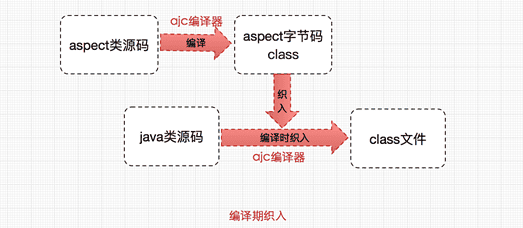

# Spring核心之面向切面编程(AOP)

文章代码：[spring-learn/spring-aop at main · lizhifuabc/spring-learn (github.com)](https://github.com/lizhifuabc/spring-learn/tree/main/spring-aop)

AOP为Aspect Oriented Programming的缩写，意为：面向切面编程

Spring 框架通过定义切面, 通过拦截切点实现了不同业务模块的解耦，这个就叫**面向切面编程**

## 基础概念

- **前置通知（Before advice）**：在某连接点之前执行的通知，但这个通知不能阻止连接点之前的执行流程（除非它抛出一个异常）。
- **后置通知（After returning advice）**：在某连接点正常完成后执行的通知：例如，一个方法没有抛出任何异常，正常返回。
- **异常通知（After throwing advice）**：在方法抛出异常退出时执行的通知。
- **最终通知（After (finally) advice）**：当某连接点退出的时候执行的通知（不论是正常返回还是异常退出）。
- **环绕通知（Around Advice）**：包围一个连接点的通知，如方法调用。这是最强大的一种通知类型。环绕通知可以在方法调用前后完成自定义的行为。它也会选择是否继续执行连接点或直接返回它自己的返回值或抛出异常来结束执行。

## Spring AOP和AspectJ

AspectJ是一个java实现的AOP框架，它能够对java代码进行AOP编译（一般在编译期进行），让java代码具有AspectJ的AOP功能（当然需要特殊的编译器）。

**动态织入**和**静态织入**：

动态织入的方式是在运行时动态将要增强的代码织入到目标类中，这样往往是通过动态代理技术完成的，如Java JDK的动态代理(Proxy，底层通过反射实现)或者CGLIB的动态代理(底层通过继承实现)，Spring AOP采用的就是基于运行时增强的代理技术。

ApectJ采用的就是静态织入的方式。ApectJ主要采用的是编译期织入，在这个期间使用AspectJ的acj编译器(类似javac)把aspect类编译成class字节码后，在java目标类编译时织入，即先编译aspect类再编译目标类。

 

| Spring AOP                                       | AspectJ                                                      |
| ------------------------------------------------ | ------------------------------------------------------------ |
| 纯 Java 中实现                                   | 使用 Java 编程语言的扩展实现                                 |
| 不需要单独的编译过程                             | 除非设置 LTW，否则需要 AspectJ 编译器 (ajc)                  |
| 只能使用运行时织入                               | 运行时织入不可用。支持编译时、编译后和加载时织入             |
| 功能不强-仅支持方法级编织                        | 更强大 - 可以编织字段、方法、构造函数、静态初始值设定项、最终类/方法等......。 |
| 只能在由 Spring 容器管理的 bean 上实现           | 可以在所有域对象上实现                                       |
| 仅支持方法执行切入点                             | 支持所有切入点                                               |
| 代理是由目标对象创建的, 并且切面应用在这些代理上 | 在执行应用程序之前 (在运行时) 前, 各方面直接在代码中进行织入 |
| 比 AspectJ 慢多了                                | 更好的性能                                                   |
| 易于学习和应用                                   | 相对于 Spring AOP 来说更复杂                                 |

## Spring AOP

常用配置

```java
// 任意公共方法的执行：
execution（public * *（..））

// 任何一个名字以“set”开始的方法的执行：
execution（* set*（..））

// AccountService接口定义的任意方法的执行：
execution（* com.xyz.service.AccountService.*（..））

// 在service包中定义的任意方法的执行：
execution（* com.xyz.service.*.*（..））

// 在service包或其子包中定义的任意方法的执行：
execution（* com.xyz.service..*.*（..））

// 在service包中的任意连接点（在Spring AOP中只是方法执行）：
within（com.xyz.service.*）

// 在service包或其子包中的任意连接点（在Spring AOP中只是方法执行）：
within（com.xyz.service..*）

// 实现了AccountService接口的代理对象的任意连接点 （在Spring AOP中只是方法执行）：
this（com.xyz.service.AccountService）// 'this'在绑定表单中更加常用

// 实现AccountService接口的目标对象的任意连接点 （在Spring AOP中只是方法执行）：
target（com.xyz.service.AccountService） // 'target'在绑定表单中更加常用

// 任何一个只接受一个参数，并且运行时所传入的参数是Serializable 接口的连接点（在Spring AOP中只是方法执行）
args（java.io.Serializable） // 'args'在绑定表单中更加常用; 请注意在例子中给出的切入点不同于 execution(* *(java.io.Serializable))： args版本只有在动态运行时候传入参数是Serializable时才匹配，而execution版本在方法签名中声明只有一个 Serializable类型的参数时候匹配。

// 目标对象中有一个 @Transactional 注解的任意连接点 （在Spring AOP中只是方法执行）
@target（org.springframework.transaction.annotation.Transactional）// '@target'在绑定表单中更加常用

// 任何一个目标对象声明的类型有一个 @Transactional 注解的连接点 （在Spring AOP中只是方法执行）：
@within（org.springframework.transaction.annotation.Transactional） // '@within'在绑定表单中更加常用

// 任何一个执行的方法有一个 @Transactional 注解的连接点 （在Spring AOP中只是方法执行）
@annotation（org.springframework.transaction.annotation.Transactional） // '@annotation'在绑定表单中更加常用

// 任何一个只接受一个参数，并且运行时所传入的参数类型具有@Classified 注解的连接点（在Spring AOP中只是方法执行）
@args（com.xyz.security.Classified） // '@args'在绑定表单中更加常用

// 任何一个在名为'tradeService'的Spring bean之上的连接点 （在Spring AOP中只是方法执行）
bean（tradeService）

// 任何一个在名字匹配通配符表达式'*Service'的Spring bean之上的连接点 （在Spring AOP中只是方法执行）
bean（*Service）
```

Spring 支持如下三个逻辑运算符来组合切入点表达式：

```java
&&：要求连接点同时匹配两个切入点表达式
||：要求连接点匹配任意个切入点表达式
!:：要求连接点不匹配指定的切入点表达式
```

Spring AOP采用的就是基于运行时增强的代理技术：

1. 接口使用JDK代理

2. 非接口使用Cglib代理

Spring 使用了@AspectJ框架为AOP的实现提供了一套注解：

| 注解名称        | 解释                                                         |
| --------------- | ------------------------------------------------------------ |
| @Aspect         | 用来定义一个切面。                                           |
| @pointcut       | 用于定义切入点表达式。在使用时还需要定义一个包含名字和任意参数的方法签名来表示切入点名称，这个方法签名就是一个返回值为void，且方法体为空的普通方法。 |
| @Before         | 用于定义前置通知，相当于BeforeAdvice。在使用时，通常需要指定一个value属性值，该属性值用于指定一个切入点表达式(可以是已有的切入点，也可以直接定义切入点表达式)。 |
| @AfterReturning | 用于定义后置通知，相当于AfterReturningAdvice。在使用时可以指定pointcut / value和returning属性，其中pointcut / value这两个属性的作用一样，都用于指定切入点表达式。 |
| @Around         | 用于定义环绕通知，相当于MethodInterceptor。在使用时需要指定一个value属性，该属性用于指定该通知被植入的切入点。 |
| @After-Throwing | 用于定义异常通知来处理程序中未处理的异常，相当于ThrowAdvice。在使用时可指定pointcut / value和throwing属性。其中pointcut/value用于指定切入点表达式，而throwing属性值用于指定-一个形参名来表示Advice方法中可定义与此同名的形参，该形参可用于访问目标方法抛出的异常。 |
| @After          | 用于定义最终final 通知，不管是否异常，该通知都会执行。使用时需要指定一个value属性，该属性用于指定该通知被植入的切入点。 |
| @DeclareParents | 用于定义引介通知，相当于IntroductionInterceptor (不要求掌握)。 |

## 示例

```java
package com.spring.aop.aspect;

import lombok.extern.slf4j.Slf4j;
import org.aspectj.lang.annotation.*;
import org.aspectj.lang.ProceedingJoinPoint;
import org.springframework.context.annotation.EnableAspectJAutoProxy;
import org.springframework.stereotype.Component;

/**
 * LogAspect: 日志切面
 *
 * @author lizhifu
 * @since 2023/9/17
 */
@EnableAspectJAutoProxy
@Component
@Aspect
@Slf4j
public class LogAspect {
    /**
     * 切入点.
     */
    @Pointcut("execution(* com.spring.aop.service.*.*(..))")
    private void pointCutMethod() {
    }


    /**
     * 环绕通知.
     *
     * @param pjp pjp
     * @return obj
     * @throws Throwable exception
     */
    @Around("pointCutMethod()")
    public Object doAround(ProceedingJoinPoint pjp) throws Throwable {
        log.info("---------------------环绕通知: 开始---------------------");
        Object o = pjp.proceed();
        log.info("---------------------环绕通知: 结束---------------------");
        return o;
    }

    /**
     * 前置通知.
     */
    @Before("pointCutMethod()")
    public void doBefore() {
        log.info("前置通知");
    }


    /**
     * 后置通知.
     *
     * @param result return val
     */
    @AfterReturning(pointcut = "pointCutMethod()", returning = "result")
    public void doAfterReturning(String result) {
        log.info("后置通知, 返回值: {}", result);
    }

    /**
     * 异常通知.
     *
     * @param e exception
     */
    @AfterThrowing(pointcut = "pointCutMethod()", throwing = "e")
    public void doAfterThrowing(Exception e) {
        log.error("异常通知, 异常: {}", e.getMessage());
    }

    /**
     * 最终通知.
     */
    @After("pointCutMethod()")
    public void doAfter() {
        log.info("最终通知");
    }
}
```


> https://pdai.tech/md/spring/spring-x-framework-aop.html