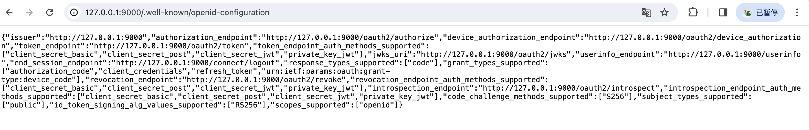

# OAuth2 Client对接认证服务

项目在初始化时会根据配置的issuer-uri拼接url，即签发地址根目录/.well-known/openid-configuration，像项目中配置的就是该接口会返回认证服务器的元信息。

```web-idl
http://127.0.0.1:9000/.well-known/openid-configuration
```



## cookie 问题

认证服务器和客户端在同一个机器上时不能使用同一个ip。[Not able to connect Spring OAuth2 Authorization Server with Client · Issue #5946 · spring-projects/spring-security (github.com)](https://github.com/spring-projects/spring-security/issues/5946)

可以一个使用 192.168.18.14:9001（内网）一个使用 127.0.0.1

## 客户端

客户端在oauth2角色解释中是第三方的一个应用，一般会配合资源服务一起使用。

单体项目

- 会同时添加资源服务依赖，客户端负责调用认证服务登录，资源服务器负责解析获取到的token，然后获取token中的权限，目前token中的权限只有scope的权限，并且不太好自定义，所以就需要通过资源服务器配置去更好的解析token。


分布式项目：

- 在网关中添加客户端依赖，检查用户认证信息，由网关代理的微服务添加资源服务依赖，解析网关通过令牌中继的方式携带的access_token；各个微服务添加自己的授权校验。
- 在网关中集成客户端依赖，同时集成资源服务依赖，由网关检查用户的认证和授权信息；各个微服务不用添加任何的认证与授权相关的处理，可以直接访问；这种方式需要屏蔽各微服务其它ip的访问，只能由网关代理访问。
