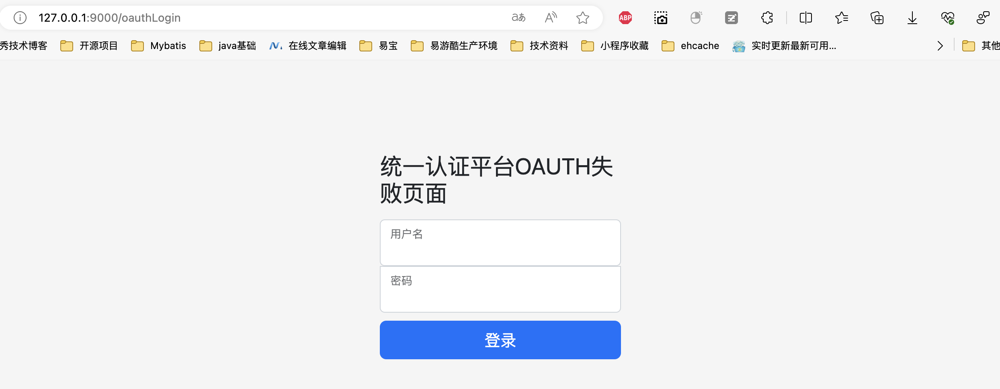
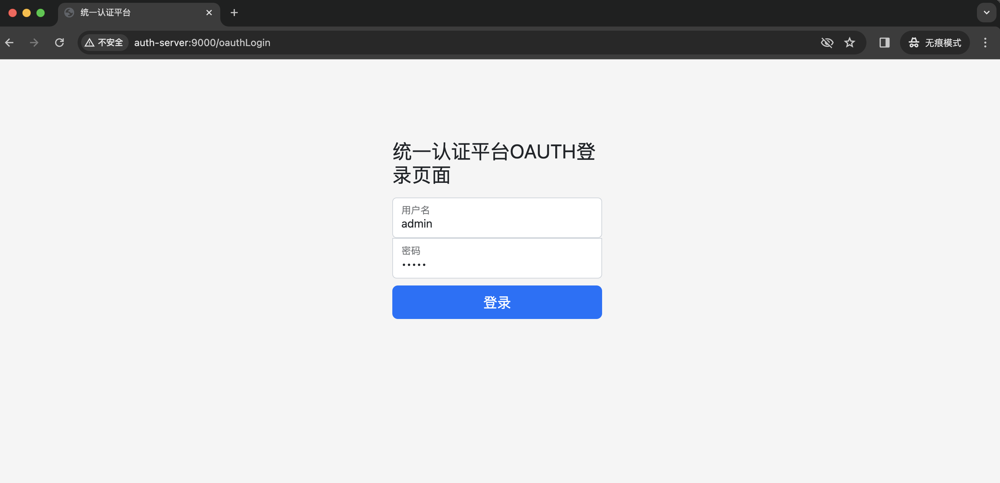
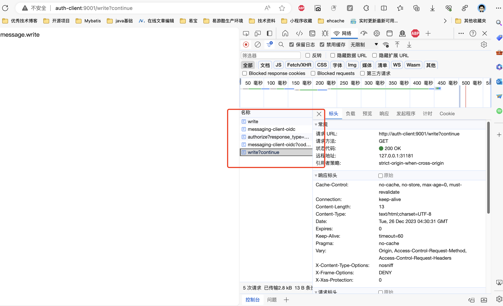
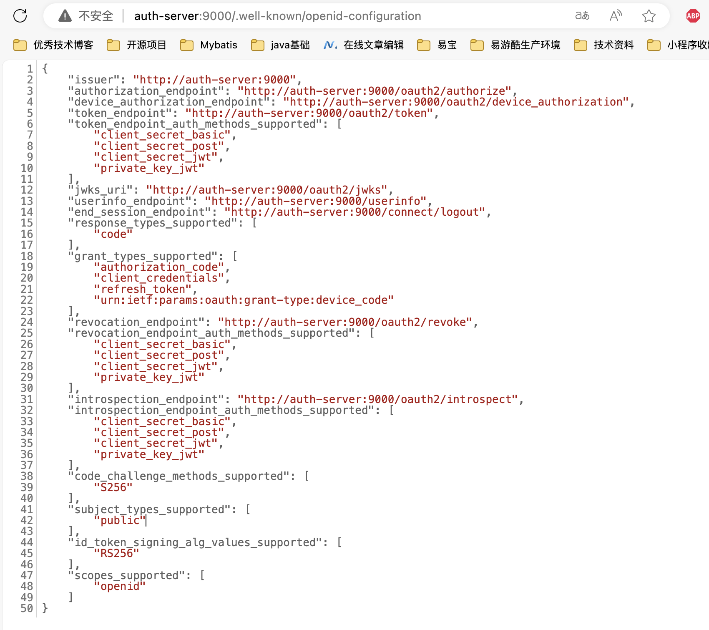

# 客户端认证授权

[lizhifuabc/spring-authorization-server-example: Spring OAuth2 Authorization Server 集成，认证服务、第三方登录、自定义grant_type等等 (github.com)](https://github.com/lizhifuabc/spring-authorization-server-example)

客户端在oauth2角色解释中是第三方的一个应用，一般会配合资源服务一起使用。即客户端也是资源服务器。

1. 单体项目
   1. 同时添加资源服务依赖，客户端负责调用认证服务登录
   2. 资源服务器配置解析token
2. 网关项目
   1. 网关中添加客户端依赖，检查用户认证信息，由网关代理的微服务添加资源服务依赖，解析网关通过令牌中继的方式携带的access_token；各个微服务添加自己的授权校验。
   2. 网关中集成客户端依赖，同时集成资源服务依赖，由网关检查用户的认证和授权信息；各个微服务不用添加任何的认证与授权相关的处理，可以直接访问；这种方式需要屏蔽各微服务其它ip的访问，只能由网关代理访问。

## 访问受限资源：@PreAuthorize

http://auth-client:9001/read

http://auth-client:9001/write

1. 访问受限资源：@PreAuthorize
2. 没有登录信息重定向至认证服务器去请求授权
3. return：没有登录则重定向至登录页面

## 用户使用账号密码登录

	

## 端点

> http://auth-server:9000/.well-known/openid-configuration

