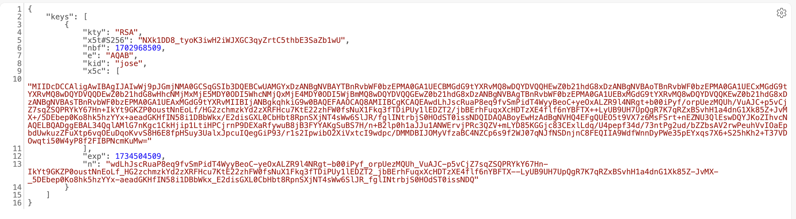
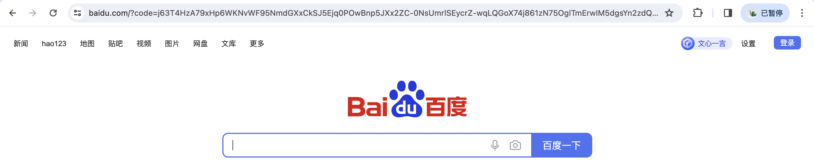
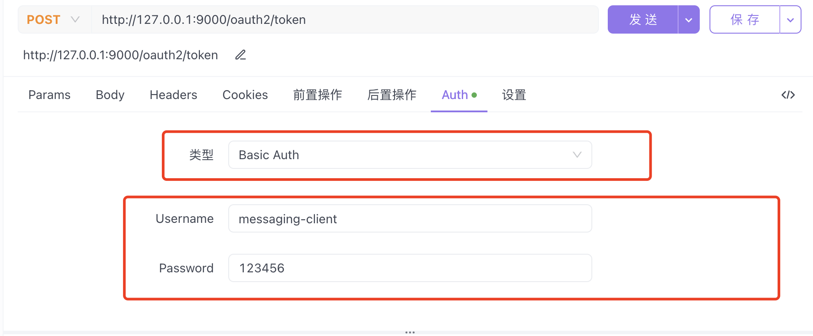
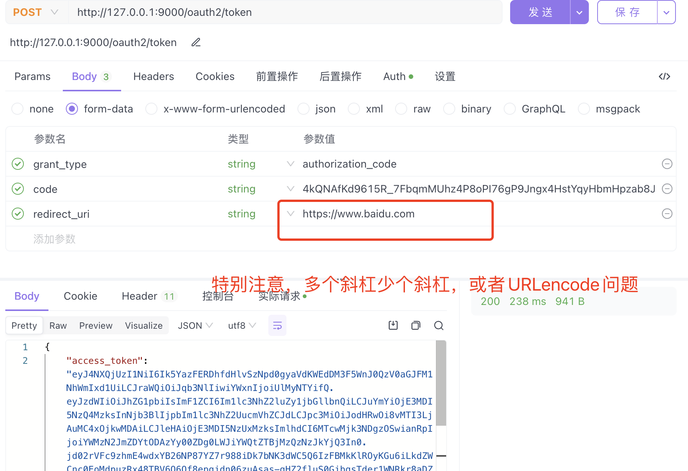

# 常用端点

- **OAuth2 Authorization Endpoint**：申请授权端点，默认为`/oauth2/authorize`
- **OAuth2 Token Endpoint**：获取访问令牌端点，默认为`/oauth2/token`
- **OAuth2 Token Introspection Endpoint**：令牌自省端点，默认为`/oauth2/introspect`
- **OAuth2 Token Revocation Endpoint**：令牌撤销端点，默认为`/oauth2/revoke`
- **OAuth2 Authorization Server Metadata Endpoint**：获取授权服务器元信息的端点，默认为`/.well-known/oauth-authorization-server`
- **JWK Set Endpoint**：`JWK`信息端点，默认为`/oauth2/jwks`
- **OpenID Connect 1.0 Provider Configuration Endpoint**：查询提供者配置端点，默认为`/.well-known/openid-configuration`
- **OpenID Connect 1.0 UserInfo Endpoint**：用户信息端点，默认为`/userinfo`
- **OpenID Connect 1.0 Client Registration Endpoint**：客户端注册端点，默认为`/connect/registe`


## 测试


/oauth2/token：OAuth 2.0 的令牌端点，用于交换授权码或刷新令牌，获取访问令牌或 ID 令牌。

/oauth2/jwks：JWK 集合端点，用于提供用于 JWT 签名和验证的公钥。

```java
// 获取授权服务器 AccessToken 解码公钥
http://127.0.0.1:9000/oauth2/jwks
```



/oauth2/userinfo：用户信息端点，用于获取已授权用户的个人资料信息。
/oauth2/keys：JSON Web Key Set 端点，用于提供签名密钥和加密密钥。

```java
http://127.0.0.1:9000/oauth2/keys
```

/oauth2/.well-known/jwks-uri：OpenID Connect 端点，用于公开 JWK 集合的 URL。

```java
http://127.0.0.1:9000/.well-known/jwks-uri
```

```json
{"issuer":"http://127.0.0.1:9000","authorization_endpoint":"http://127.0.0.1:9000/oauth2/authorize","device_authorization_endpoint":"http://127.0.0.1:9000/oauth2/device_authorization","token_endpoint":"http://127.0.0.1:9000/oauth2/token","token_endpoint_auth_methods_supported":["client_secret_basic","client_secret_post","client_secret_jwt","private_key_jwt"],"jwks_uri":"http://127.0.0.1:9000/oauth2/jwks","response_types_supported":["code"],"grant_types_supported":["authorization_code","client_credentials","refresh_token","urn:ietf:params:oauth:grant-type:device_code"],"revocation_endpoint":"http://127.0.0.1:9000/oauth2/revoke","revocation_endpoint_auth_methods_supported":["client_secret_basic","client_secret_post","client_secret_jwt","private_key_jwt"],"introspection_endpoint":"http://127.0.0.1:9000/oauth2/introspect","introspection_endpoint_auth_methods_supported":["client_secret_basic","client_secret_post","client_secret_jwt","private_key_jwt"],"code_challenge_methods_supported":["S256"]}
```


1. /oauth2/authorize OAuth 2.0 的授权端点，用于获取授权码或访问令牌。：
response_type：必需。表示授权服务器应该返回的授权类型。通常为 code 或 token。
client_id：必需。客户端 ID，授权服务器用于验证客户端。
redirect_uri：可选。授权服务器重定向用户的 URI。
scope：可选。表示客户端请求的授权范围。
state：可选。授权服务器将在重定向 URI 中包含此参数，用于防止 CSRF 攻击。
code_challenge 和 code_challenge_method：可选。用于 PKCE 验证的参数。

```java
// 重定向至登录页面
http://127.0.0.1:9000/oauth2/authorize?client_id=messaging-client&response_type=code&scope=message.read&redirect_uri=https://www.baidu.com
```




```java
https://www.baidu.com/?code=4kQNAfKd9615R_7FbqmMUhz4P8oPI76gP9Jngx4HstYqyHbmHpzab8JtXnhE70OWZgBfVUvmfjXcLNRBbi7BIWsV9vNFHMn5V6EkoAJFGCm4MJzByvjjiZQa7_eP_3ww
```


2. /oauth2/token 根据code换取AccessToken，令牌端点的请求参数：
   grant_type：必需。表示客户端请求的授权类型，通常为 authorization_code、password、client_credentials 或 refresh_token。
   code：必需（仅在授权类型为 authorization_code 时）。授权码。
   redirect_uri：必需（仅在授权类型为 authorization_code 时）。与请求授权码时使用的重定向 URI 相同。
   client_id 和 client_secret：必需。客户端 ID 和密钥。
   username 和 password：必需（仅在授权类型为 password 时）。用户凭据。
   refresh_token：必需（仅在授权类型为 refresh_token 时）。刷新令牌。
   scope：可选。请求的授权范围。





/oauth2/userinfo 用户信息端点的请求参数：
access_token：必需。访问令牌。

/oauth2/keys JSON Web Key Set 端点的请求参数：无。

/oauth2/.well-known/jwks-uri OpenID Connect 端点的请求参数：无。
