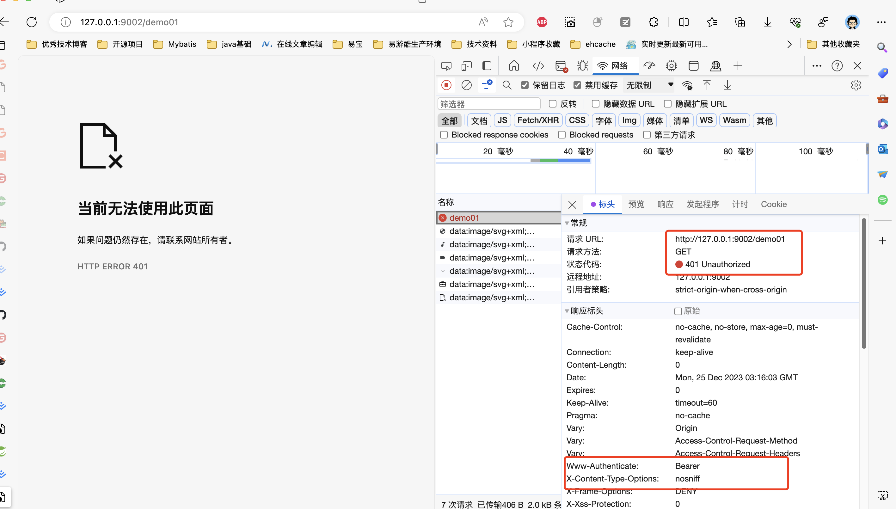

# 资源服务器

[OAuth 2.0 Resource Server :: Spring Security](https://docs.spring.io/spring-security/reference/servlet/oauth2/resource-server/index.html)

注意：

Resource server和oauth2 client一样，是一个单独的服务，不需要跟认证服务器的版本保持一致。

## Bearer Tokens

[OAuth 2.0 Bearer Tokens :: Spring Security](https://docs.spring.io/spring-security/reference/servlet/oauth2/resource-server/bearer-tokens.html)

默认情况下，资源服务器在Authorization标头中查找承载令牌。

## 示例

[lizhifuabc/spring-authorization-server-example: Spring OAuth2 Authorization Server 集成，认证服务、第三方登录、自定义grant_type等等 (github.com)](https://github.com/lizhifuabc/spring-authorization-server-example)

### 访问未授权地址

http://127.0.0.1:9002/demo01

### 认证服务器获取 access_token

