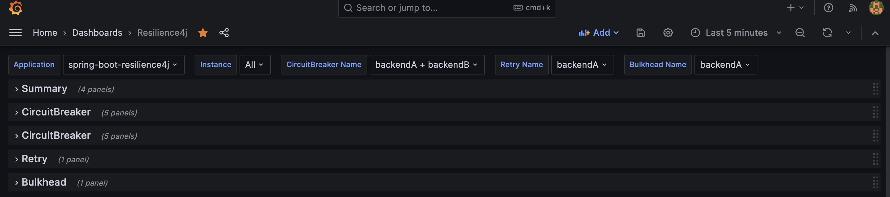

# Resilience4j

Github:

[resilience4j/resilience4j: Resilience4j is a fault tolerance library designed for Java8 and functional programming (github.com)](https://github.com/resilience4j/resilience4j)

官方文档：

[Introduction (readme.io)](https://resilience4j.readme.io/docs)

Resilience4j 是一个用于构建弹性（resilience）和容错性（fault tolerance）机制的 Java 库。它是基于 Netflix Hystrix 的一个替代方案，旨在提供更加灵活和可扩展的方式来处理分布式系统中的故障和容错问题。Resilience4j 提供了一组模块，可以轻松地集成到您的应用程序中，以帮助您处理各种故障情况，包括超时、断路、重试、限流等。

- Circuit Breaker（断路器）：Resilience4j 提供了一个灵活的断路器模块，可以防止应用程序不断地调用故障的服务或资源。断路器可以在一段时间内统计失败的请求次数，并在达到阈值后打开断路器，阻止进一步的请求，以避免对故障的资源进行过多的调用。

  ```xml
  <dependency>
      <groupId>io.github.resilience4j</groupId>
      <artifactId>resilience4j-circuitbreaker</artifactId>
      <version>${resilience4jVersion}</version>
  </dependency>
  ```

  

- Rate Limiter（速率限制器）：根据预设的阈值限制对服务的请求流量,常与隔离仓配合使用。

  ```xml
  <dependency>
      <groupId>io.github.resilience4j</groupId>
      <artifactId>resilience4j-ratelimiter</artifactId>
      <version>${resilience4jVersion}</version>
  </dependency>
  ```

- TimeLimiter（超时控制）：通过 TimeLimiter 模块，您可以设置超时限制，确保请求不会无限期地等待响应，从而避免资源浪费。

  ```xml
  <dependency>
      <groupId>io.github.resilience4j</groupId>
      <artifactId>resilience4j-timelimiter</artifactId>
      <version>${resilience4jVersion}</version>
  </dependency>
  ```


- Retry（重试）：当调用失败时自动重试指定的次数。重试之间可以设置时间间隔,避免立即重试导致目标服务过载。

  ```xml
  <dependency>
      <groupId>io.github.resilience4j</groupId>
      <artifactId>resilience4j-retry</artifactId>
      <version>${resilience4jVersion}</version>
  </dependency>
  ```

  

- 缓存 - 对结果进行缓存,避免重复请求造成不必要开销。

  ```xml
  <dependency>
      <groupId>io.github.resilience4j</groupId>
      <artifactId>resilience4j-cache</artifactId>
      <version>${resilience4jVersion}</version>
  </dependency>
  ```

  

- EventPublisher 和 Metrics：Resilience4j 提供了事件发布和度量功能，以便监控断路器、重试和其他机制的性能和状态。- 提供近乎实时的监控调用链路的Metrics数据。 

  ```xml
  <dependency>
      <groupId>io.github.resilience4j</groupId>
      <artifactId>resilience4j-micrometer</artifactId>
      <version>${resilience4jVersion}</version>
  </dependency>
  ```

  接入：Grafana

  [resilience4j/grafana_dashboard.json at master · resilience4j/resilience4j (github.com)](https://github.com/resilience4j/resilience4j/blob/master/grafana_dashboard.json)

- Bulkhead（舱壁模式）：这个模块允许您将不同的任务隔离在不同的线程池中，以避免一个故障的任务影响其他任务的执行。

  ```xml
  <dependency>
      <groupId>io.github.resilience4j</groupId>
      <artifactId>resilience4j-bulkhead</artifactId>
      <version>${resilience4jVersion}</version>
  </dependency>
  ```

- 全部依赖

  ```xml
  <dependency>
      <groupId>io.github.resilience4j</groupId>
      <artifactId>resilience4j-all</artifactId>
      <version>${resilience4jVersion}</version>
  </dependency>
  ```

  

## 引用

spring boot：

```xml
<!-- spring-boot2 -->
<dependency>
    <groupId>io.github.resilience4j</groupId>
    <artifactId>resilience4j-spring-boot2</artifactId>
    <version>${resilience4jVersion}</version>
</dependency>

<!-- spring-boot3 -->
<dependency>
    <groupId>io.github.resilience4j</groupId>
    <artifactId>resilience4j-spring-boot3</artifactId>
    <version>${resilience4jVersion}</version>
</dependency>
```

spring cloud：[Spring Cloud Circuit Breaker](https://docs.spring.io/spring-cloud-circuitbreaker/docs/current/reference/html/)

```xml
<dependency>
    <groupId>org.springframework.cloud</groupId>
    <artifactId>spring-cloud-starter-circuitbreaker-reactor-resilience4j</artifactId>
</dependency>
```

```xml
<dependency>
    <groupId>org.springframework.cloud</groupId>
    <artifactId>spring-cloud-starter-circuitbreaker-resilience4j</artifactId>
  </dependency>
```

## 注解使用resilience4j

```xml
<dependency>
    <groupId>org.springframework.boot</groupId>
    <artifactId>spring-boot-starter-aop</artifactId>
</dependency>
```

## circuitbreaker（状态）

circuitbreaker有三个典型的状态：`CLOSED`、`OPEN`、`HALF_OPEN`

两个特殊的状态：`DISABLED`和`FORCED_OPEN`

- `CLOSED`状态时，正如电气中的断路器合上一样，所有的调用可以正常执行，在这个状态，circuitbreaker会持续统计调用的结果情况，如果失败率或慢调用率超过了指定的阈值，circuitbreaker的状态会变为`OPEN`状态。
- `OPEN`状态的circuitbreaker不允许任何调用，所有的调用都会返回`CallNotPermittedException`异常。经过设定的一段时间后，circuitbreaker的状态会变为`HALF_OPEN`状态。在这个状态中circuitbreaker允许部分的调用，同时持续统计调用的结果情况，如果失败率或慢调用率仍然低于指定的阈值，则仍然回到OPEN状态，如果失败率和慢调用率都高于指定的阈值，则变为`CLOSED`状态，恢复正常调用。
- `DISABLED`和`FORCED_OPEN`则是两个管理状态，这两个状态下，上述的断路器逻辑不生效，`DISABLED`强制允许所有的调用，`FORCED_OPEN`强制拒绝所有的调用。

circuitbreaker通过滑动窗口来统计调用的失败率和慢调用率。滑动窗口分为基于计数的滑动窗口和基于时间的滑动窗口。滑动窗口在实现上其实就是一个`ring-buffer`，基于计数的滑动窗口记录了最近N次调用的情况，然后根据这N次调用的失败率和慢调用率确定circuitbreaker的状态。

基于时间的滑动窗口每间隔一个滑动步长时间窗口向前推进，每一个滑动步长时间区间维护一个桶，在这个时间区间内的调用结果统计到该桶中，然后根据整个窗口中所有桶内的统计数据综合得出调用的失败率和慢调用率，然后确定circuitbreaker的状态。

默认情况下，circuitbreaker把所有抛出异常的调用都统计为失败的调用，用户也可以指定具体哪些异常才统计为失败调用。

需要注意的是，circuitbreaker保护的对象并不是自己，而是被调用的对象。因为在微服务环境中，往往会存在重试机制，当被调用对象无法正常处理请求时，不使用circuitbreaker机制的话，被调用对象的流量压力会更高，从而更容易崩溃，进而导致整个系统崩溃。circuitbreaker就是在检测到被调用对象不正常时，暂停对它的调用，从而保护被调用对象，进而保护整个系统。

## 添加监控

1. Grafana

​		[resilience4j/grafana_dashboard.json at master · resilience4j/resilience4j (github.com)](https://github.com/resilience4j/resilience4j/blob/master/grafana_dashboard.json)

2. Prometheus：需要重启（有一些配置修改后可以通过 reload 机制热加载,不需要完全重启服务）

   ```yml
     - job_name: spring-boot-resilience4j
       # 采集间隔
       scrape_interval: 5s
       # 采集超时
       scrape_timeout: 5s
       # 指标路径
       metrics_path: /actuator/prometheus
       static_configs:
         - targets:
             - 192.168.31.156:7080 # SpringBoot 应用的 IP 和端口
   ```

   

​		刷新配置：

```shell
curl -X POST http://prometheus:9090/config_reload
sudo systemctl reload prometheus
```

## 比较

|                | Sentinel                                         | Hystrix(维护状态)       | Resilience4j（Spring推荐）              |
| :------------- | :----------------------------------------------- | :---------------------- | :-------------------------------------- |
| 开发者         | alibaba                                          | Netflix                 | 独立                                    |
| 隔离策略       | 信号量隔离（并发线程数限流）                     | 线程池隔离/信号量隔离   | 信号量隔离                              |
| 熔断降级策略   | 基于响应时间、异常比率、异常数                   | 基于异常比率            | 基于异常比率、响应时间                  |
| 实时统计实现   | 滑动窗口（LeapArray）                            | 滑动窗口（基于 RxJava） | Ring Bit Buffer                         |
| 动态规则配置   | 支持多种数据源                                   | 支持多种数据源          | 有限支持                                |
| 扩展性         | 多个扩展点                                       | 插件的形式              | 接口的形式                              |
| 基于注解的支持 | 支持                                             | 支持                    | 支持                                    |
| 限流           | 基于 QPS，支持基于调用关系的限流                 | 有限的支持              | Rate Limiter                            |
| 流量整形       | 支持预热模式、匀速器模式、预热排队模式           | 不支持                  | 简单的 Rate Limiter 模式                |
| 系统自适应保护 | 支持                                             | 不支持                  | 不支持                                  |
| 控制台         | 提供控制台，可配置规则、查看秒级监控、机器发现等 | 简单的监控查看          | 不提供控制台，可对接其它监控系(Grafana) |

