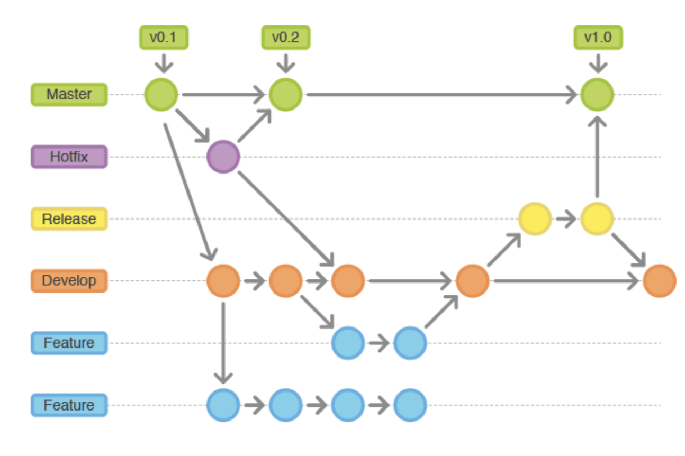

# Git分支规范

1. master（main） 分支

   主分支，也是用于部署生产环境的分支，一般由 release 以及 hotfix 分支合并，不能直接修改代码。master 分支的每一次更新，都建议打 tag 添加标签，通常为对应版本号，便于管理。

2. develop（dev） 分支

   主开发分支，包含所有要发布到下一个Release的代码，保持最新完成以及bug修复后的代码，一般开发的新功能时，feature分支都是基于develop分支创建。

3. feature 分支（合并后可以删除）

   开发新功能时，以develop为基础创建feature分支。可以采用 feature_功能名称的命名方式。

4. test 分支

   测试环境分支，外部用户无法访问，专门给测试人员使用，版本相对稳定。

5. release 分支

   预上线分支（预发布分支），UAT测试阶段使用，一般由 test 或 hotfix 分支合并，不建议直接在 release 分支上直接修改代码。

6. hotfix 分支（合并后可以删除）

   紧急问题修复，以master分支为基线，创建hotfix分支，需要合并到 master 分支和 develop 分支。 hotfix_修复 命名规范

总结：

| 分支    | 功能                      | 环境             | 可访问 |
| :------ | :------------------------ | :--------------- | :----- |
| master  | 主分支，稳定版本          | 生产环境         | 是     |
| develop | 开发分支，最新版本        | 开发者调试       | 是     |
| feature | 开发分支，实现新特性      | 本地开发         | 否     |
| test    | 测试分支，功能测试        | 测试环境         | 是     |
| release | 预上线分支，发布新版本    | 用户验收测试环境 | 是     |
| hotfix  | 紧急修复分支，修复线上bug | 本地开发         | 否     |

