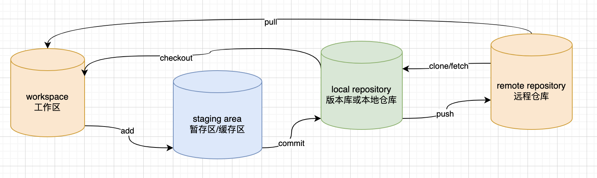

# Git 基本操作

Git 常用的是以下 6 个命令：**git clone**、**git push**、**git add** 、**git commit**、**git checkout**、**git pull**



## git 全局配置

```shell
# 全局用户名密码 & 记住用户名密码
git config --global user.name "bryan sun"
git config --global user.email "hitsjt@gmail.com"

git config --global credential.helper store
```

## 创建仓库命令

| 命令        | 说明                                   |
| :---------- | :------------------------------------- |
| `git init`  | 初始化仓库                             |
| `git clone` | 拷贝一份远程仓库，也就是下载一个项目。 |

## 提交与修改

| `git add`    | 添加文件到暂存区                         |
| ------------ | ---------------------------------------- |
| `git status` | 查看仓库当前的状态，显示有变更的文件。   |
| `git diff`   | 比较文件的不同，即暂存区和工作区的差异。 |
| `git commit` | 提交暂存区到本地仓库。                   |
| `git reset`  | 回退版本。                               |
| `git rm`     | 将文件从暂存区和工作区中删除。           |
| `git mv`     | 移动或重命名工作区文件。                 |

```shell
# 把暂存区中的文件提交到本地仓库，调用文本编辑器输入该次提交的描述信息
$ git commit

# 把暂存区中的文件提交到本地仓库中并添加描述信息
$ git commit -m "<提交的描述信息>"

# 把所有修改、已删除的文件提交到本地仓库中
# 不包括未被版本库跟踪的文件，等同于先调用了 "git add -u"
$ git commit -a -m "<提交的描述信息>"

# 修改上次提交的描述信息
$ git commit --amend
```

```shell
# 把指定的文件添加到暂存区中
$ git add <文件路径>

# 添加所有修改、已删除的文件到暂存区中
$ git add -u [<文件路径>]
$ git add --update [<文件路径>]

# 添加所有修改、已删除、新增的文件到暂存区中，省略 <文件路径> 即为当前目录
$ git add -A [<文件路径>]
$ git add --all [<文件路径>]

# 查看所有修改、已删除但没有提交的文件，进入一个子命令系统
$ git add -i [<文件路径>]
$ git add --interactive [<文件路径>]

```

## 提交日志

| 命令               | 说明                                 |
| :----------------- | :----------------------------------- |
| `git log`          | 查看历史提交记录                     |
| `git blame <file>` | 以列表形式查看指定文件的历史修改记录 |

## 远程操作

| 命令         | 说明               |
| :----------- | :----------------- |
| `git remote` | 远程仓库操作       |
| `git fetch`  | 从远程获取代码库   |
| `git pull`   | 下载远程代码并合并 |
| `git push`   | 上传远程代码并合并 |

```shell
# 更改仓库地址
1、git remote rm origin（删除远程地址）
# ‘[]’内为新的git仓库地址，真实写命令时不要带中括号‘[]’
2、git remote add origin [url]
# 分支master 设置为跟踪来自origin的远程分支master
3、git branch –set-upstream-to=origin/master master
```

## 忽略被提交过的文件夹

```shell
# 怎样忽略被提交过的.idea文件夹
1：敲入 git rm -r --cached .idea （要是报错,就试一下git rm  --cached .idea -r)
2：敲入 git commit -m"删除不需要的文件夹"
3：git push


git rm -r --cached .
git add .
git commit -m 'update .gitignore'
```

## 强制覆盖本地

- git强制覆盖本地命令（分步执行）：

  ```shell
  git fetch --all
  git reset --hard origin/main
  git pull
  ```


- git强制覆盖本地命令（单条执行）：

  ```shell
  git fetch --all && git reset --hard origin/main && git pull
  ```

## Fork 代码和提交

1. fork

2. clone 你 **fork** 仓库的代码

3. git remote -v 

   ```shell
   ➜  old-ma-java git:(master) git remote -v
   origin  https://gitee.com/lizhifu/old-ma-java.git (fetch)
   origin  https://gitee.com/lizhifu/old-ma-java.git (push)
   ```

4. git remote add upstream 添加源仓库

   ```shell
   ➜  old-ma-java git:(master) git remote add upstream https://gitee.com/xiaomgmarz/old-ma-java
   ➜  old-ma-java git:(master) git remote -v                                                   
   origin  https://gitee.com/lizhifu/old-ma-java.git (fetch)
   origin  https://gitee.com/lizhifu/old-ma-java.git (push)
   upstream        https://gitee.com/xiaomgmarz/old-ma-java (fetch)
   upstream        https://gitee.com/xiaomgmarz/old-ma-java (push)
   ➜  old-ma-java git:(master) 
   ```

5. git fetch upstream 拉取源仓库分支

   ```shell
   ➜  old-ma-java git:(master) git fetch upstream
   remote: Enumerating objects: 4, done.
   remote: Counting objects: 100% (4/4), done.
   remote: Compressing objects: 100% (3/3), done.
   remote: Total 3 (delta 0), reused 0 (delta 0), pack-reused 0
   Unpacking objects: 100% (3/3), 1.79 KiB | 916.00 KiB/s, done.
   From https://gitee.com/xiaomgmarz/old-ma-java
    * [new branch]      master     -> upstream/master
   ```

6. git merge upstream/master 合并远程master分支到本地分支

   存在冲突时：

   ```
   ➜  old-ma-java git:(master) git merge upstream/master
   Auto-merging README.md
   CONFLICT (content): Merge conflict in README.md
   Automatic merge failed; fix conflicts and then commit the result.
   ➜  old-ma-java git:(master) ✗ 
   ```

7. git push 推送到自己的远程