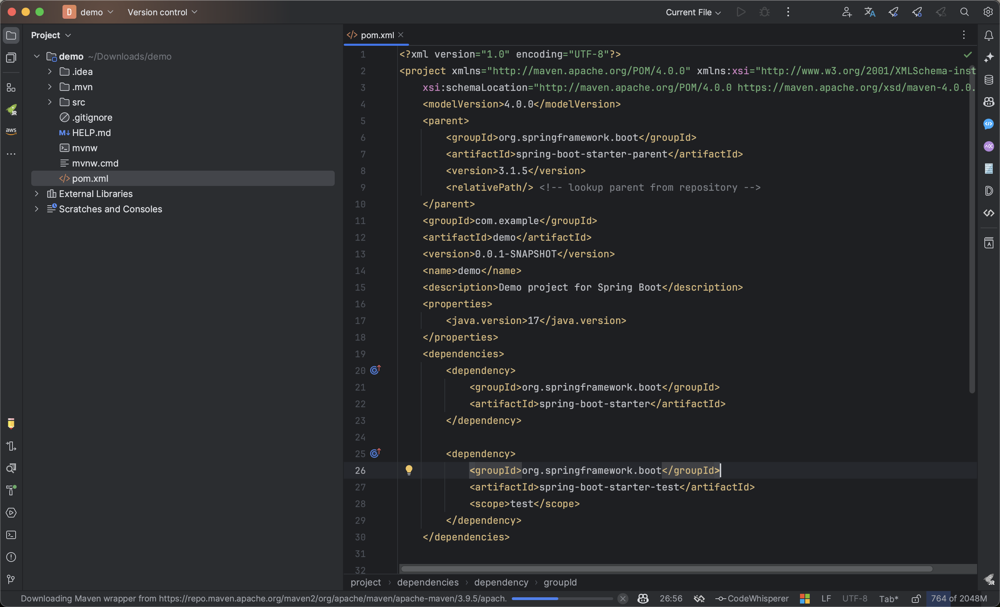
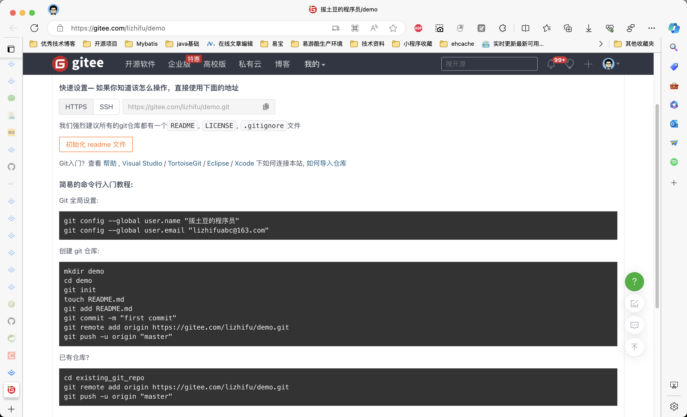
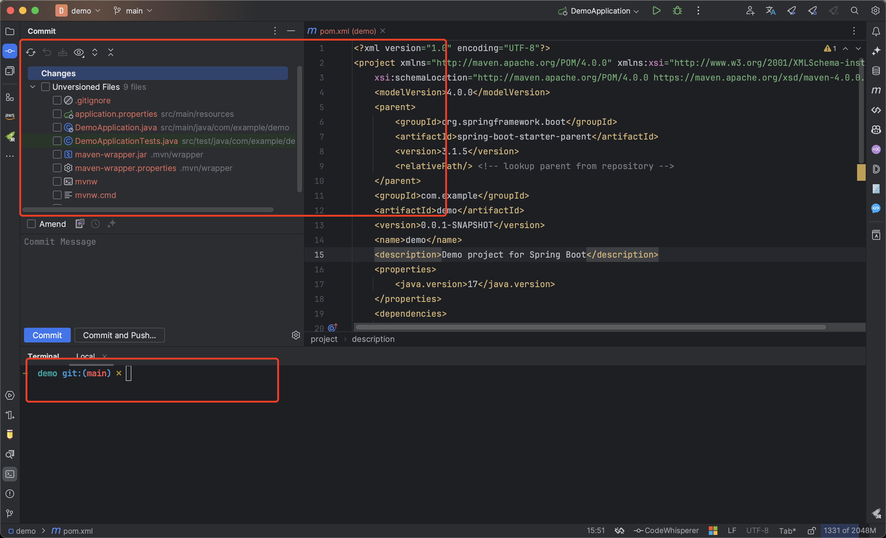
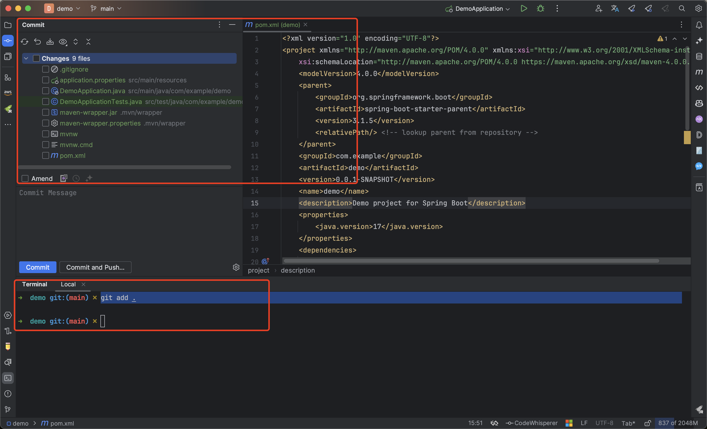
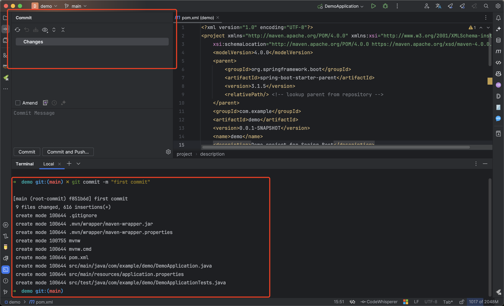
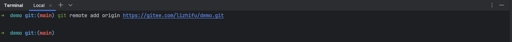

# 从0到1分支操作

从0到1演示git分支操作。

## 创建项目

创建项目并导入到IDE

[Spring Initializr](https://start.spring.io/)

## 创建远程项目

以gitee为例。https://gitee.com/

[拔土豆的程序员/demo (gitee.com)](https://gitee.com/lizhifu/demo)

## 本地项目初始化

1. 进入项目根目录：git init，此时会发现创建了git版本控制

   

2. 执行 `git add .` 将文件加入到版本控制

   

3. 提交本地代码：git commit -m "first commit"

   

4. 将远程仓库添加到当前项目的 Git 配置中，并将其命名为 `origin`：`git remote add origin https://gitee.com/lizhifu/demo.git`

   