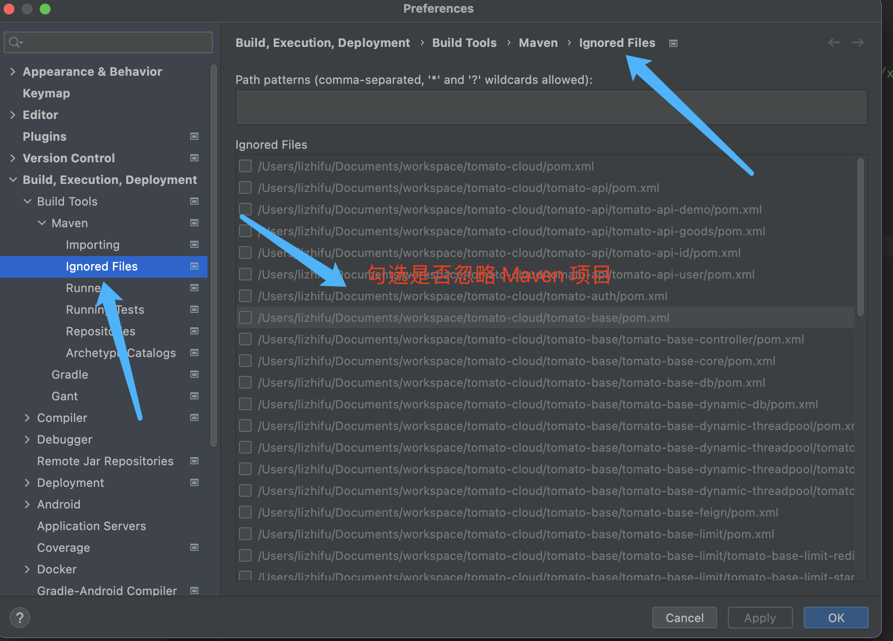
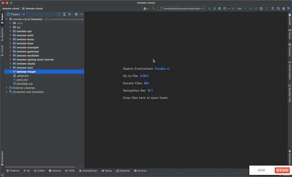

# 常见问题

记录碰到的常见问题。

## 通过java-agent破解之后无法打开

1. 首先修改 /Applications/IntelliJ IDEA.app/Contents/bin/idea.vmoptions 是没有作用的，这个是安装的默认配置，类似于恢复默认时使用的内容。
2. 需要修改 /Users/lizhifu/Library/Application Support/JetBrains/IntelliJIdea2023.2/idea.vmoptions （替换相应的版本号）

意外的发现：去掉 java-agent 构建速度和占用都变的顺滑多了。

## POM文件不识别

